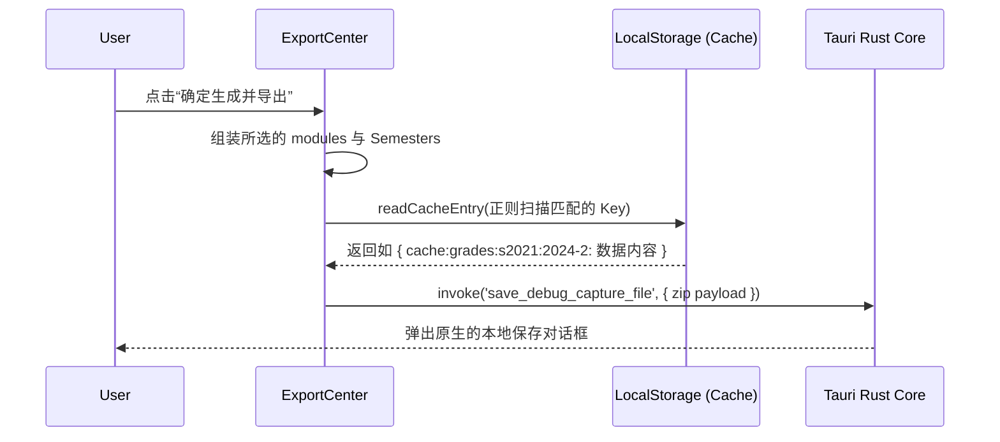

# 全能数据导出归档中心 (ExportCenterView.vue)

## 1. 模块定位与职责

随着学生使用 App 多年，成绩单、课表、修读信息往往被封锁在教务系统深处，学校不提供一键打包功能导致考研复试、留学查档极为痛苦。
`ExportCenterView.vue` 是一个旨在提供**“一键把大学装进口袋”**功能的高级面板。它跨越了前端视图展示的限制，直接利用 Tauri 本地底座 `invokeNative` 将学生的各个私密 JSON 缓存全部归集，打包成不可轻易篡改的集合快照。

## 2. 三维功能组阵列定义 (`moduleGroups`)

通过将功能分为 “学业、基础、生活”，不仅是出于 UI 分类，更控制了每个模块是否需要附带**“学期过滤 (semesterAware)”**的元数据：
```javascript
const moduleGroups = [
  {
    id: 'academic',
    title: '学业类',
    modules: [
      { id: 'grades', name: '成绩查询', semesterAware: true },
      { id: 'academic_progress', name: '学业完成情况', semesterAware: false } // 与学期无关，看总体
    ]
  }
]
```

## 3. 拦截沙箱的无头读取机制 (`readCacheEntry`)

数据打包引擎并未通过 Axios 重新发包发起洪泛攻击，而是利用之前各组件在 `fetchWithCache` 埋入的 `localStorage(cache:...)` 指纹：



如果用户没网，或者教务处正在修剪服务器，他依旧能完美打包自己最后一次连线时的资产。

## 4. 离线渲染隔离屏障

`ExportCenter` 除了作为数据处理端，还关联了底层的 `renderElementToCanvas` 和 `capture_service.ts` 的隐形窗口技术。能够脱离当前屏幕滚动位置的限制，将学生的个人信息板以截图形式塞入 Export 的 Payload 中，保证给出的不只是一堆 JSON，更是直观可证的图像快照凭证。