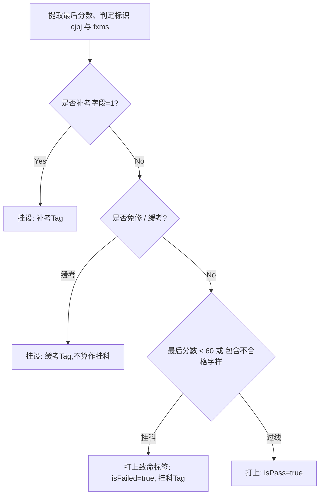

# 学分精算与成绩洗涤仪 (GradeView.vue)

## 1. 模块定位与架构职责

成绩界面不仅仅是一个简单的列表排列。“考了多少分”、“绩点怎么算”、“挂科情况”直接关系到奖学金、考研和保研的资格认定。
`GradeView.vue` 可以说是该项目除了强认证模块以外算法最为密集的业务模块。兼顾了分数解析、字典回退匹配、自动标签高亮以及全学期穿透聚合。

## 2. 万能字符集映射解析与强计算器 (`normalizedGrades`)

由于成绩有时不是具体的分而是：“合格”，“通过”，“免修”，甚至带有各种奇怪中文字符结构：

### 2.1 分数转化与绩点强推

```javascript
const parseScoreNumber = (score) => {
  const n = Number.parseFloat(toSafeText(score)) // 如果能解析为数字，那就是分制
  return Number.isFinite(n) ? n : null
}
```
并通过五分制映射式强推 `gradePointNumber = (score / 10) - 5` 以规避部分系统不吐露绩点的数据缺口。

### 2.2 状态标签工厂流 `resolveStatusTags`

这一功能负责让系统立刻判断出：“这门课有毒”。


## 3. 面向学期的群组聚集渲染引擎 (`Grouped Mode`)

应用拥有两种渲染视图（All / Grouped）。因为有时候需要按时间回溯：
- 依靠 `terms` 把包含所有课的大数组使用 `Array.from(termSet)` 切成学期片签。
- 通过计算属性 `filteredGrades` 对数组根据当前的搜索栏 `searchName` 和是否勾选了挂科雷达 `filterPass === 'fail'` 进行清洗过滤。
- 随后将数据投送进瀑布流卡片中，并且利用 `showAdvancedFilters` 向高阶用户释出细粒度的过滤面板。这种极致的防雪崩洗数保障了数据准确性和公平观感。