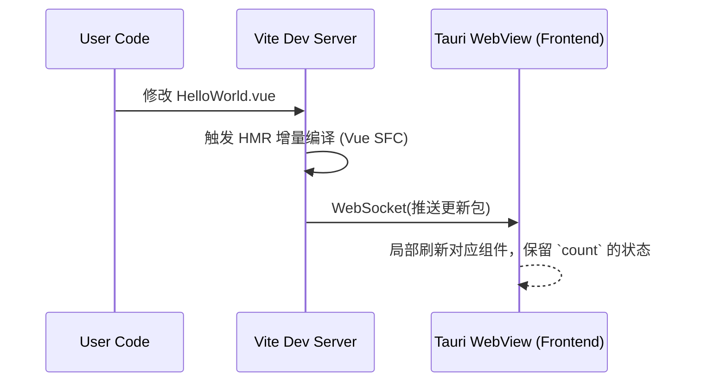

# 占位结构基座 (HelloWorld.vue)

## 1. 模块边界与功能定位

`HelloWorld.vue` 是标准的 Vite + Vue 3 的脚手架默认组件。在本项目中，虽然它不是正式应用业务逻辑的一部分，但它在工程初期起到了验证 Vue 编译器 (Compiler SFC) 状态、HMR (热重载) 链路连通性、以及样式基础重置作用。

## 2. 状态驱动范式展示

组件不仅包含静态 HTML，还内置了 `ref` 的响应式变量更新机制。

```javascript
import { ref } from 'vue'

defineProps({
  msg: String,
})

const count = ref(0)
```

## 3. 热替换 (HMR) 探针分析

如果底层 Vite Server (即 `localhost:1420` 或类似端口配置) 和 Tauri 底层的 WebView 成功绑定。当我们热更组件代码时：

这个脚手架组件常用来向新手开发者指示“你的环境已就绪”，避免因为配置错误（如未正确引用 `vite.config.js`）带来的空自怀疑。