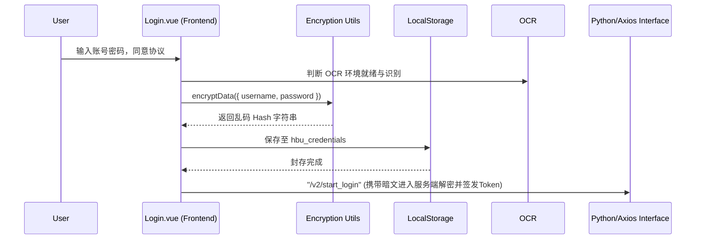

# 一体化无痕登陆枢纽 (Login.vue)

## 1. 业务痛点分析设计

由于频繁的校园网验证掉线、Token 过期等烦恼，学生往往一天内需要多次重新登录。传统表单效率极地。
`Login.vue` 被设计成不仅仅是一个密码输入框，它是整个 App 接管自动化运维的重要中枢环节，它挂载了**OCR验证码识别环境检测、数据持久化隐形缓存、Hash静默签入**。

## 2. 动态 OCR 分析与热源备用池

打码系统对外部服务器的依赖很大。登录组件会在挂载期利用 Rust 层 `invoke('get_ocr_runtime_status')` 或获取本地 Config 侦测识别服务器的有效性。

```javascript
const refreshOcrMode = async (endpointHint = '') => {
  const runtime = await invoke('get_ocr_runtime_status')
  ocrConfigMode.value = resolveOcrModeLabel(runtime, endpointHint)
}
```
**如果远程服务器失效，就会降级采用 `local_fallback_endpoints`**。

## 3. URL Hash 极速调配机制

应用提供了一个十分前沿的设计以处理多账号分享与唤起流程（DeepLink）：
```javascript
  const hash = window.location.hash
  if (hash) {
    const studentMatch = hash.match(/^#\/(\d{10})$/)
    if (studentMatch) {
      username.value = studentMatch[1]
      await quickFetch() //如果存在缓存直接放行进入主页面
      return
    }
  }
```

## 4. 全局加密层级存储与安全隧道

为了能让下次登陆一键通过，账户密码将进入重重加密锁：

整个流转过程彻底规避了明文泄露，满足现代合规应用的“不可溯查”特性。