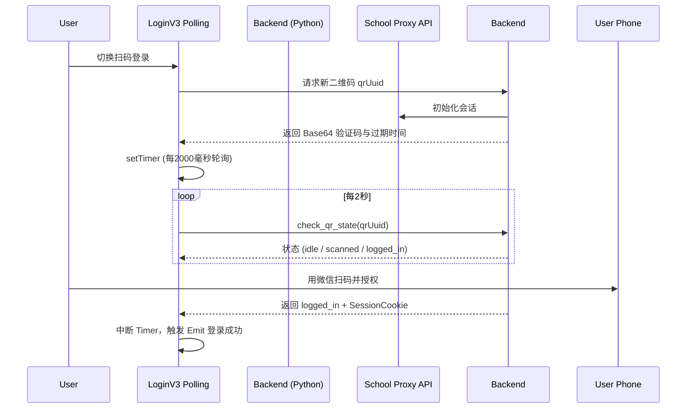

# 异构多源登录矩阵调度 (LoginV3.vue)

## 1. 模块边界与架构定位

相比于经典的 `Login.vue`，`LoginV3.vue` 进行了史诗级的架构重构。由于湖北工业大学的多个登录入口常常因为防火墙策略而互相挂断，`LoginV3` 是一个“容灾级”多模态登录枢纽。
不仅支持常规的融合门户 (Portal) 基于账号密码的强行突破，还在其失效时，降级支持 **“学习通 (Chaoxing) 限定模式”** 以及**免密码的深信服/企业微扫码登录 (QR Login)**。

## 2. Token提取与学号多源嗅探 (resolveChaoxingStudentId)

学习通模式下返回的报文，并不总是会老老实实带上学号（它可能只带有手机号或是长达数十位的一串加密 uid）。为了能将其强行映射回本校账库，设置了探针瀑布流：
```javascript
const resolveChaoxingStudentId = async (payload = null) => {
  const payloadSid = pickStudentIdCandidate(payload)
  if (payloadSid) return payloadSid
  const cachedSid = String(localStorage.getItem('hbu_username') || '').trim()
  if (isLikelyStudentId(cachedSid)) return cachedSid
  // 降级使用底层 Tauri 请求
  if (isTauriRuntime()) {
    const studentInfo = await invoke('fetch_student_info') // ...
  }
}
```
通过逐级提取 payload `student_id`、扫描本地散存 `hbu_username`、甚至直接在未完全鉴权时要求 Rust 强突后端获取个人信息，完美补足了断链问题。

## 3. 扫码心跳轮询引擎 (QR Code Polling)

二维码的登录不同于 RESTful 的一来一回，它是基于 Token 状态的持续探针：


这部分通过定义 `cxQrState` 等严格的有限状态机机制，并且做了 `qrPollingBusy` 强制锁，防止因网差造成并发轰炸。

## 4. 隔离式密码保险箱

为了安全隔离学习通手机号和老教务内网的库表，通过独立的 KEY `CHAOXING_ACCOUNT_KEY` 与主密码体系剥离。
而且挂载了内联 Debug 机制 `pushDebugLog` 允许用户在面临网络高塔阻断时将错误信息通过按钮截获导出给开发者。