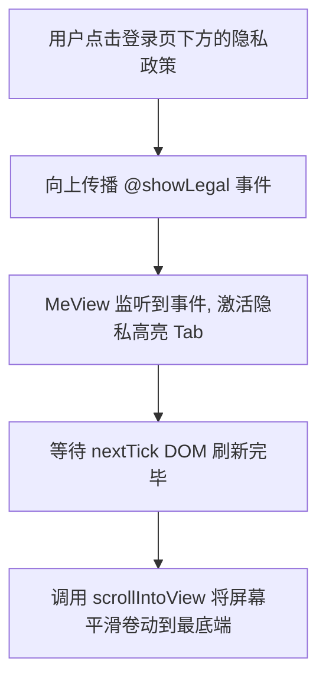

# 个人资产与系统配电盘 (MeView.vue)

## 1. 模块角色和职责定义

`MeView.vue` 承载着类似微信中“我的”模块的关键职责。它是用户信息、权限控制以及底层系统功能（更新、日志脱水、后台通知）的聚合入口。不同于复杂的课表视图，此界面的核心是**重定向与沙盒调教**。

## 2. 身份隔离与白名单路由守卫 (`isConfigAdmin`)

为了保护敏感的教务 API 配置，只有存在于管理员序列库的超级用户才能触发展开控制核心机制：

```javascript
const isConfigAdmin = () => Array.isArray(props.configAdminIds) && props.configAdminIds.includes(props.studentId)
```

当该条件成立时，底层模板会额外渲染：
```html
<button v-if="isConfigAdmin()" class="link-item" @click="handleOpenConfig">
    <!-- SVG 图标 -->
    <span class="link-text">配置工具</span>
</button>
```
这是一种极为轻量的软路由守卫（Soft Route Guard），即便后续逆向解包前端，若缺乏配套的管理员 Cookie 签名，强制前往该路由也会被后端的拦截器掐断。

## 3. 免责闭环与滚动锚定

免责声明是一个非常长且冗余的文本，为保证用户的视觉体验，采取了平滑锚定跳跃（Smooth Anchor Jump）：

```javascript
const handleShowLegal = async (tab) => {
  activeLegalTab.value = tab
  await nextTick()
  if (legalSectionRef.value?.scrollIntoView) {
    legalSectionRef.value.scrollIntoView({ behavior: 'smooth', block: 'start' })
  }
}
```



## 4. 图标矩阵化渲染器 (Glass Card)

模块完全抛弃了笨重的依赖库（如 ElementPlus），而是直接通过内联原生 SVG 编绘操作选项。使用 `glass-card` 的毛玻璃虚化设计风格，这种脱离框架束缚的原生写法能大幅裁剪打包阶段的 Rollup Chunk 的体积限制。