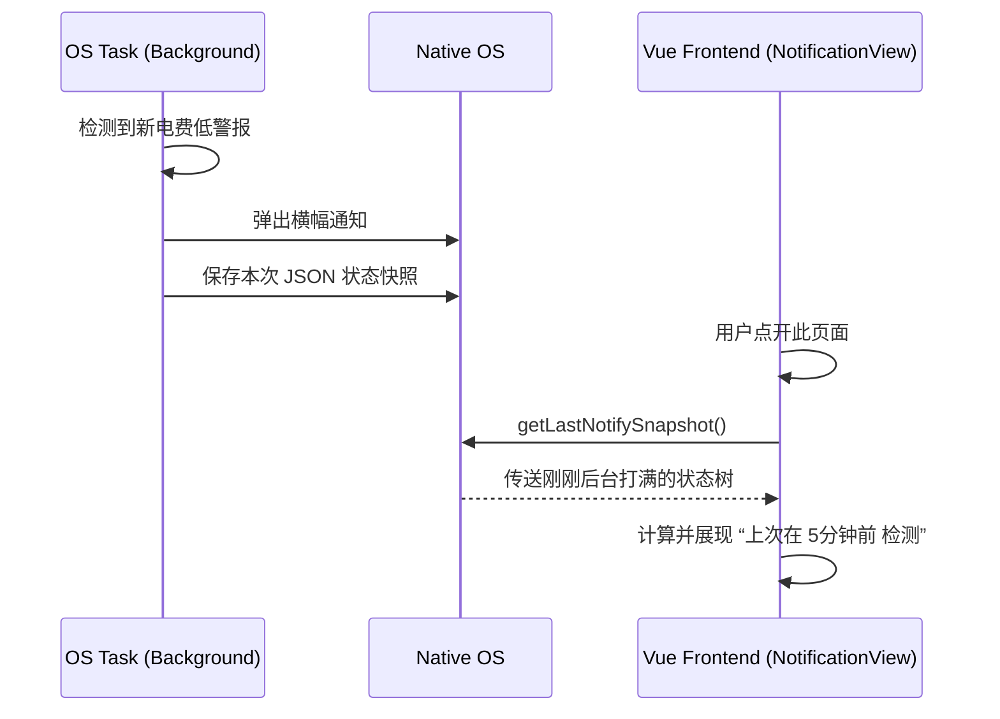

# 守护进程与全候广播中心 (NotificationView.vue)

## 1. 模块宏观定位

通常情况下如果想要在前端定时获取“新成绩是否出分”或“电费是否低于5元”，应用必须一直开在前台。
`NotificationView.vue` 是一个跨越高壁垒，直接穿透浏览器沙盒限制、联络手机/系统底层系统广播的指挥部。它负责注册定时任务、拦截休眠机制，并通过 Tauri/Capacitor 写入守护进程（Daemon）。

## 2. 跨平台休眠唤醒锁机制 (`BackgroundPowerLock`)

由于 Android 对于耗电极为严苛，普通的 `setInterval` 如果挂在后台，大概五分钟就会被杀死。
模块引入了 `enableBackgroundPowerLock` 和 `disableBackgroundPowerLock` 桥接命令：

```javascript
import { getBackgroundFetchRuntimeState, syncBackgroundFetchContext } from '../utils/background_fetch.js'
// ...
const saveSettings = () => {
  // 将设置塞入本地外，还要强行拉起与后台线程的同步
  syncBackgroundFetchContext({
    studentId: props.studentId,
    settings: {
      enableBackground: enableBackground.value, //...
    }
  })
}
```

## 3. 多端自适应环境识别网 (`runtimeDisplayText`)

开发者编写了一个精准的三相架构判断矩阵，从而决定当前向用户展示哪一种电池限制解除指引：
```javascript
const runtimeDisplayText = computed(() => {
  const ua = String(navigator.userAgent || '')
  if (currentRuntime.value === 'capacitor') return `... / Capacitor`
  if (currentRuntime.value === 'tauri') {
    return '桌面端 / Tauri'
  }
  return '浏览器 / Web'
})
// 如果遇到权限拒绝，则向用户发送引导授权提示 `isAclDeniedError`
```

## 4. 快照聚合解析器 (`snapshot.value`)

组件本身并不会亲自去发 Ajax 获取电费或成绩，而是利用后台进程丢出的快照文件：



以此来向用户证实“即便你关闭了App，我们的云端/后台小精灵仍在默默运转守护你”。