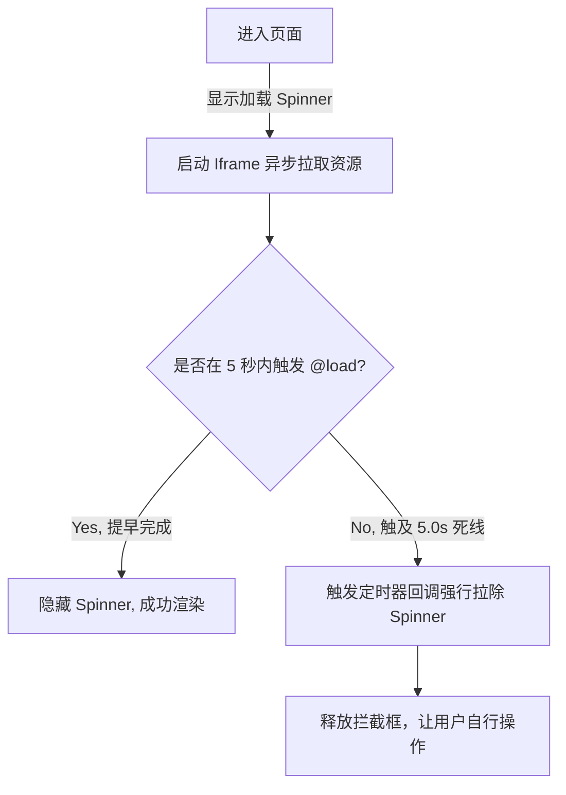

# 校园官方情报接驳窗 (OfficialView.vue)

## 1. 模块开发背景

开发者在运营此类第三方应用时，很容易跟校园官方更新不同步（系统升级、教务换服、放假通知）。为此系统需要一块快速发声且无需发版（Update Release）的地带。由于该公告频次不可控，如果写死在代码内会导致更新困难，`OfficialView.vue` 通过内嵌云文档成为了云端控制板。

## 2. 降配沙箱防御策略

跟 `FeedbackView` 如出一辙，组件引入了一段官方腾讯文档长连：
`https://docs.qq.com/doc/DQnVTWFFFbEhNTXhx`
并且使用了最为原生的降权沙盒挂载：
```html
<iframe 
    sandbox="allow-scripts allow-same-origin allow-forms allow-popups allow-popups-to-escape-sandbox"
></iframe>
```
这是防御性质的（Defensive Programming），假设某个别有用心的人破解了我的云文档并写了一串 `document.cookie` 劫持代码，因没有给与 `allow-top-navigation` 等越权标量，外壳的 Tauri 及浏览器安全墙将会立刻绞杀这个尝试。

## 3. 防加载时序卡死方案 (Spinner KillSwitch)

外接服务器永远存在延迟和单点故障的可能性：
```javascript
onMounted(() => {
  // 设置超时，如果5秒后还在加载就隐藏loading
  setTimeout(() => {
    loading.value = false
  }, 5000)
})
```



## 4. 外联逃逸与Clipboard操作器

组件右上角携带了 `openInBrowser` 和 `copyLink` ：
```javascript
const copyLink = async () => {
    await navigator.clipboard.writeText(officialUrl)
    showToast('链接已复制到剪贴板！', 'success')
}
```
借助现代浏览器的 `navigator.clipboard` 规范原生接口。哪怕在最低端的网页端或者桌面端跨域，也能保证能把网址赋予剪切板通过 Safari/Chrome 来破解无法渲染的死局。