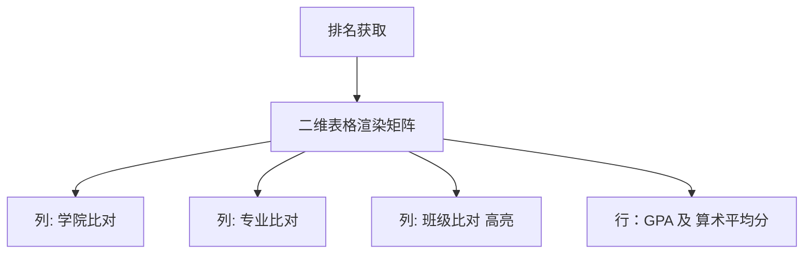

# 学业排位与竞争洞察面板 (RankingView.vue)

## 1. 业务逻辑与核心定位

成绩计算不仅关乎个人，在大学体系下，排名直接关乎到了保研资格和奖学金分布。
教务接口给出的绩点排名分散复杂且存在巨大的时效偏差。`RankingView.vue` 从数据核心直接调取学生的横向比对数据，生成直观的三级排名漏斗（同班 / 同专业 / 同学院）。

## 2. 多重离线与弱网妥协机制

相比成绩单查询，排名查询的服务器压力巨大。组件底层使用了强制兜底机制 `fetchWithCache` 包裹 Axios：

```javascript
    const cacheKey = `ranking:${props.studentId}:${selectedSemester.value || 'all'}`
    const { data } = await fetchWithCache(cacheKey, async () => {
      const res = await axios.post(`${API_BASE}/v2/ranking`)
      return res.data
    })
    // 渲染时判定：
    offline.value = !!data.offline
```
一旦离线标识拉高，界面会在顶部弹出醒目的横幅：
```html
<div v-if="offline" class="offline-banner">
  当前显示为离线数据，更新于{{ formatRelativeTime(syncTime) }}
</div>
```
让学生理解当前数值可能并不代表“今晚某同学考完试后的最新顺位”。

## 3. 统计交叉双轨基准比对

组件在试图展现排名时，分别从两条截然不同的数值指标进行评估：
- **平均学分绩点 (GPA)**：带有大学色彩的权重算法。
- **算术平均分**：直接总分相除，部分老旧学院的特定评优可能会按此执行。

通过渲染二维表：

配合高亮的 `.highlight-rank` 和 `.gpa-badge` 给学生带来“战报级”的最优化信息摄取密度。