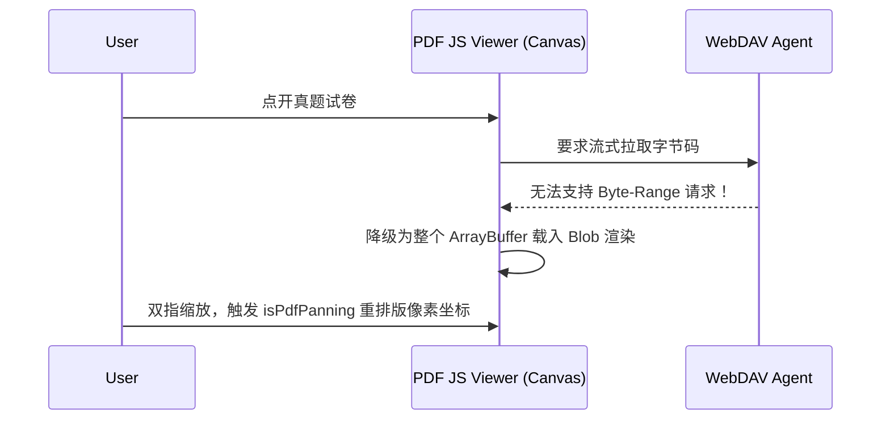

# 分布式学习库与云盘解析器 (ResourceShareView.vue)

## 1. 模块边界与功能定位

这是一个极为庞大的多媒体集成资源中心组件。为了避开高昂的服务器带宽费用并将四六级资料、公开文档分发给学子，开发者采用了基于 HuggingFace Space 的外部免费 WebDAV 源作为驱动核心。
`ResourceShareView.vue` 需要跨过云端安全防御、跨域问题、文档解析（如PDF与媒体流）构建一个完整的网盘操作系统界面。

## 2. CDN 热注入与外挂组件工厂

针对一些体量巨大的预览库（如 `xgplayer` 解决 MP4 视频渲染，`pdfjs-dist` 解决原卷刷写），为了不去拖累打包后首屏加载时长（这会导致白屏），选择了运行时异步注入脚本的极限模式。

```javascript
const CDN_ASSETS = {
  xgplayerScript: [
    'https://cdn.jsdelivr.net.cn/.../xgplayer@3.0.22/dist/index.min.js',
    'https://unpkg.com/xgplayer@3.0.22/dist/index.min.js'
  ]
}
// 后续触发 loadScriptFromCdn 等降级方法装载
```
一旦某 CDN (比如 jsdelivr 突然被封)，它能毫秒级切回 unpkg 继续尝试，保证了预览组件的安全着陆。

## 3. 深维 WebDAV 请求重定向机制

因为浏览器存在极其严苛的 CORS 跨域政策，前端无法针对 `mini-hbut-chaoxing-webdav` 直接请求并显示内容。模块通过内置桥接 `getProxyUrl` 将跨域抛给内侧或 Tauri 的 `localhost:4399/bridge` 中枢代理解决。

```javascript
const getProxyUrl = (path) => {
  const query = new URLSearchParams({
    endpoint: endpoint.value,
    path: normalizePath(path),
    //...
  })
}
```

## 4. 特种预览：微软内嵌与 PDF 矩阵降级

当遭遇 `.doc` / `.ppt` 时：
采用多候选轮询 `officePreviewCandidates`，首选 `https://view.officeapps.live.com/op/embed.aspx` 让微软的服务器来解析云端只读副本。

当对付 `.pdf` 时：

这是个高度定制的渲染流水线引擎。保障不论设备大小和网络如何残缺也能最终给出知识阅读方案。