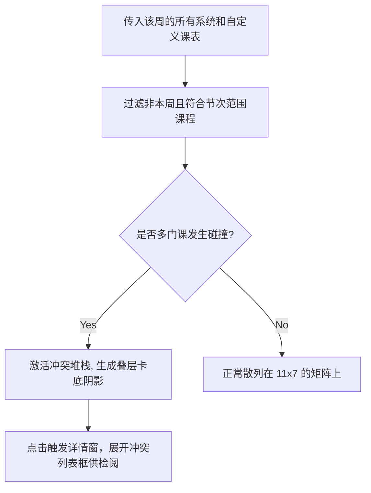

# 课程矩阵引擎与漫游视图 (ScheduleView.vue)

## 1. 系统地位与责任概述

作为该产品最高频使用的功能之一，`ScheduleView.vue` 面对着极其复杂的挑战逻辑。它必须同时容纳“教务网络拉取的系统课表”与“学生自己添加的自定义课程”，并且需要支持离线使用、按周推演滚动、以及云端同步的完整漫游周期。

## 2. 漫游周历控制器 (`currentWeek` & 动画偏移)

学期的进度并不是一成不变的，系统会在挂载期利用开学日的算法校准当前该处于哪一周。
当用户进行操作拨弄课表（切换周）时，需要引入方向感：

```javascript
// 在模板绑定 <transition :name="weekTransitionName">
const weekTransitionName = ref('week-slide-left')
```
当进入下一周时，课程块由于 `nextTick` 及动画绑定，能呈现出极其丝滑的原生抽屉滑动视效，强化对时间的实体感知。

## 3. 课程重叠堆叠与预编译渲染层

有些课往往会在同一个时段出现（比如单周上实验课，双周上理论课）。此时渲染器就会把一天的 11 节划块（grid）。



## 4. 全局云同步与脏数据洗涤 (`syncCloud`)

针对用户自己打下的课（往往是选修或体测时间），需要存入数据库防止应用卸载丢失。
应用内联了严格挂锁的机制 `runCloudSyncUpload` 和 `runCloudSyncDownload`。在用户执行添加/修改课程提交成功后的钩子里引发。
同时在本地存入 `customScheduleData` 利用数组拼接的组合形式跟网络教务数据打在一张呈现视图中。保障了个人需求和系统配发的平滑过渡（Smooth Transition）。