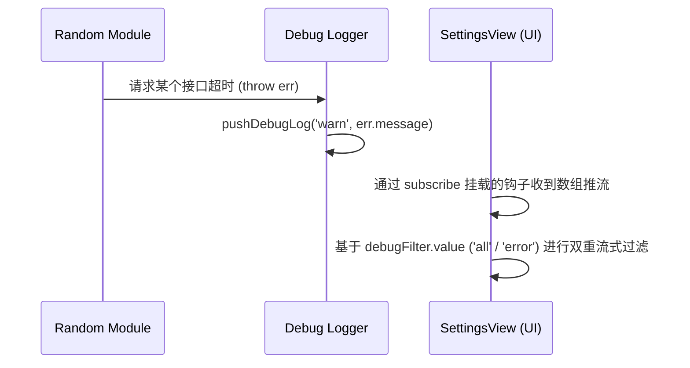

# 应用首选项与实验功能实验室 (SettingsView.vue)

## 1. 模块宏观架构

与其他只显示数据的视图不同，`SettingsView.vue` 是一个深维度的可交互中枢，它连接着应用运行时的命脉配置（如：UI主题、字体渲染库、调试控制台、云同步控制）。

## 2. 动态 Web Font （字体云注入技术）

传统的移动端 H5 里几乎没法更换字体，因为把一个中文字体打进包里会让 App 膨胀数个 MB。组件巧妙利用了按需抓取策略 `prefetchCdnFonts` 与 `loadDeyiHeiFont`：

```javascript
const FONT_DISPLAY_NAME = {
  heiti: '黑体',
  songti: '宋体',
  deyihei: '得意黑'
}

// 缓存状态推导器
const prefetchButtonText = computed(() => {
  const pending = String(pendingFontKey.value || '').trim()
  if (pending && pending !== 'default') {
    return `预缓存${FONT_DISPLAY_NAME[pending] || pending}`
  }
  return '先选字体再缓存'
})
```
这利用了浏览器的 Cache API 或跨设备 WebDAV，让一些高规格视觉设计的字体库可以像图片一样懒加载覆盖整个 DOM。

## 3. 极客级调试控制台与日志脱水器

由于此应用往往由学生自主部署在某些特定校园专网内，开发者无法触达环境，此时内嵌的 Debug 面板就显得尤为关键。它接管了底层的 `getDebugLogs` 和 `subscribeDebugLogs`。


并且提供了极其细致的状态指标灯：
```javascript
const debugStats = computed(() => {
  const total = debugLogs.value.length
  const errors = debugLogs.value.filter((item) => item.level === 'error').length
  // ...渲染徽章展示给最终用户
})
```

## 4. OCR与后端熔断机制控制（Kill Switch）

如果某天公共 OCR 接口完全宕机。这块面板还提供了手动输入私有代理（如 Localhost 或者用户自己搭的服务器）用作逃生出口（Override fallback）。应用了强管控的安全防范（`LOCAL_HOST_PATTERN` 等进行校验），将复杂性通过此面板完全向高阶用户透明化。