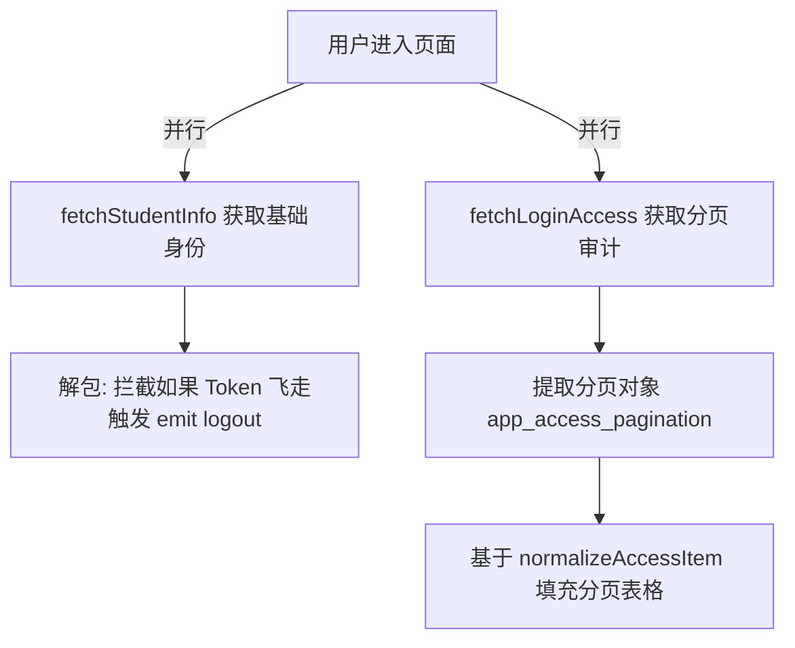

# 学籍档案库与安全审计台 (StudentInfoView.vue)

## 1. 模块定位与数据敏感性

`StudentInfoView.vue` 不仅展示了学生的基础信息（如身份证、民族、行政班级），更核心的隐藏诉求是监控其密码是否泄漏。因为它接入了教务系统的 `login_records`（安全漫游审计），允许学生查询自己账号的当前活跃地点和历史登录凭证。

## 2. 脏数据极限归一化 (Data Normalization Factory)

教务系统由于历经多代技术栈（包含但不限于早期 JSP 和近期 SpringBoot），其返回的用户会话对象存在着字段灾难级的混乱。开发组构建了极度鲁棒的解析引擎：

```javascript
const normalizeLoginItem = (item) => ({
  client_ip: normalizeString(item.client_ip ?? item.clientIp ?? item.ip),
  ip_location: normalizeString(item.ip_location ?? item.ipLocation ?? item.location, '未知'),
  login_time: normalizeString(item.login_time ?? item.loginTime ?? item.last_login_time),
  browser: normalizeString(item.browser ?? item.browser_name ?? item.client_browser)
})
```
依靠 nullish coalescing (`??`) 形成阶梯状兜底，把不同时代的接口返回值统一压平为视图模型！

## 3. 安全行为模式雷达分析

对于登录状态，系统进行了一层黑灰名单的关键词硬洗涤提取出用户能够理解的安全指标饰带：
```javascript
const normalizeAuthResult = (value) => {
  const text = normalizeString(value, 'unknown')
  const lower = text.toLowerCase()
  if (lower.includes('success') || lower.includes('pass') || lower === 'ok' || text.includes('成功')) {
    return '成功'
  }
  if (lower.includes('fail') || lower.includes('deny') || text.includes('失败')) {
    return '失败' // 直接渲染警告色
  }
  return text
}
```

## 4. 双轨异步渲染流 (`fetchLoginAccess`)

由于基础学籍 `fetchStudentInfo` 快如闪电，而漫长的历史审计日志极慢，该组件将生命周期的挂载点一分为二。


这种并发分离不但避免了长时间的白屏“Skeleton Loading”，并且利用了 Vue Cache 的 `EXTRA_LONG_TTL` 将变化频率极低的基础信息死锁在本地存储，防止教务处的并发拦截。