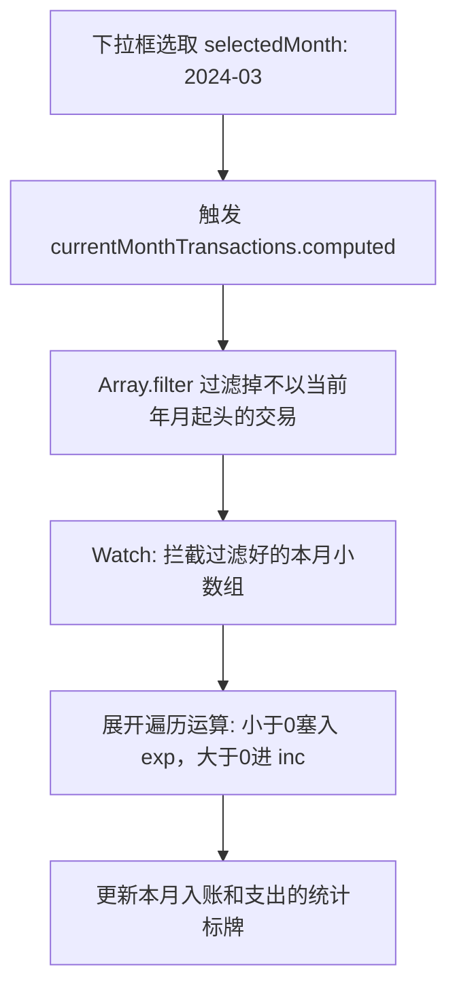

# 校园卡流水审计中心 (TransactionHistory.vue)

## 1. 业务责任边界

校园一卡通往往不仅用来吃饭，还会被用于水控、电费直扣甚至超额机房机时费。
`TransactionHistory.vue` 构建了一个纯前端落地的流水审查台。系统能够接管后台的脏数据直接在内部完成月份切分（Slice by Month）和借贷算式的重新聚合对冲。

## 2. 脏时间轴清洗与强转（Date Parser）

教务系统的流水经常被包裹成各种无法直接交给前端 `Date()` 的奇葩格式：
```javascript
const parseDateString = (value) => {
  if (typeof value === 'string') {
    if (/^\d{4}-\d{2}-\d{2}/.test(trimmed)) return trimmed // 拦截合法形态
    const parsed = new Date(trimmed)
    if (!isNaN(parsed.getTime())) return parsed.toISOString().replace('T', ' ').slice(0, 19)
  }
}
```
并且金额被重命名为了诸如 `amt`, `amount`, `money`, `fee`, `tradeAmount` 等近乎多态的形式，所以提供了一个巨型的字典反射来进行全字段搜捕。

## 3. 响应式流水算盘与月度切片

每次当用户从下拉框中选择不同月份时，无需再去重新发送网络发包。
系统依靠一次性全抓取的 `rawTransactions`（利用 `page_size: 1000` 将年级流水一网打尽）配合 `computed` 完成切片：



## 4. 后台离线快照防呆机制

当校园卡系统宕机时（常发生在夜间）：
```javascript
const isSuccess = res?.success === true || Array.isArray(res?.resultData) //...
if (isSuccess) {
  offline.value = !!res.offline
  syncTime.value = res.sync_time || ''
}
```
界面会激活顶部琥珀色横幅警告，暗示学生不要因“交易未入账”而引发金钱恐慌，它这只是来自本地持久层的上一次成功抓取。