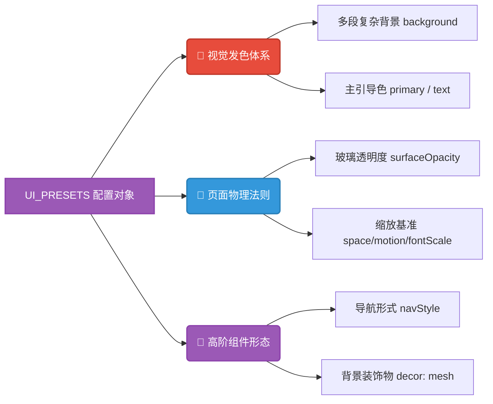

# `src/config/ui_settings.ts` 动态主题与配置字典核心解析

## 1. 文件概览

`ui_settings.ts` 堪称是本应用外观展示的主控制台（Theme Registry）。它通过 TypeScript 的强类型定义，构建了一套可以快速拔插的结构化主题包。从夜间深海模式到充满大学清爽气息的薄荷森林，这些皮肤不仅定义了颜色，同时也重写了页面的动效幅度、字体大小和边框锐利度。

### 1.1 核心职责与功能
1. **类型护航**: 导出如 `UiThemeCategory`、`DensityStyle` 等精确联合类型，杜绝前端对 UI 字符串进行乱写的可能。
2. **预设库 (Profiles Registry)**: `UI_PRESETS` 这个巨型对象提供多达数种截然不同风格（包括背景、文字、蒙层属性）的皮肤。
3. **出厂默认载荷挂载**: 提供全局初始化变量常量 `SYSTEM_UI_SETTINGS` 防止用户第一次打开因为白板配置造成的页面崩溃。

---

## 2. 主题派发配置数据流

本图展示了一份 `UiPreset` 中所包含的三大核心度量。



### 2.1 架构深度解读

#### a. 针对长期观看优化的色彩科学
```typescript
graphite_night: {
    label: '深海石墨',
    background: 'radial-gradient(...), linear-gradient(150deg, #0a1120 0%, #0f172a 52%, #1e293b 100%)',
    motionScale: 0.95 // 削弱 5% 的动效
    //...
}
```
通过观察 `graphite_night` 主题的设计，可以发现它不止简单的把 `#FFFFFF` 变成了黑色。它的背景包含了三层极其平滑幽暗的径向渐变（Radial Gradient）来模拟打光效果以防止产生视觉疲劳。作者甚至将动画系数 `motionScale` 微降到了 `0.95` 来避免黑色高对比度元素在剧烈运动时导致的拖影。

#### b. 极致严密的形态学强类型 (Morphology Typing)
```typescript
export type NavStyle = 'floating' | 'pill' | 'compact'
export type DecorStyle = 'mesh' | 'grain' | 'none'
```
该系统并不是仅仅换个颜色。它甚至提供了让用户更换应用程序基础物理骨架的能力。“浮动模式(floating)”、“胶囊模式(pill)” 提供了同一应用但是两套截然不同组件表现的手法。而这一切都被 TypeScript 强行锁定在这几种可行域中，避免了应用被意外的异常参数拉崩。

#### c. 平滑过渡的注入基础 (`SYSTEM_UI_SETTINGS`)
在进入页面没有建立持久化数据（如通过 Pinia 持久化 `localStorage`）之前，程序将会向外抛出这个常数。它将默认启动极具校园风的皮肤 `campus_blue`，它的存在让框架（Vue）在第一次打通状态层和表现层时提供了稳固抓手。