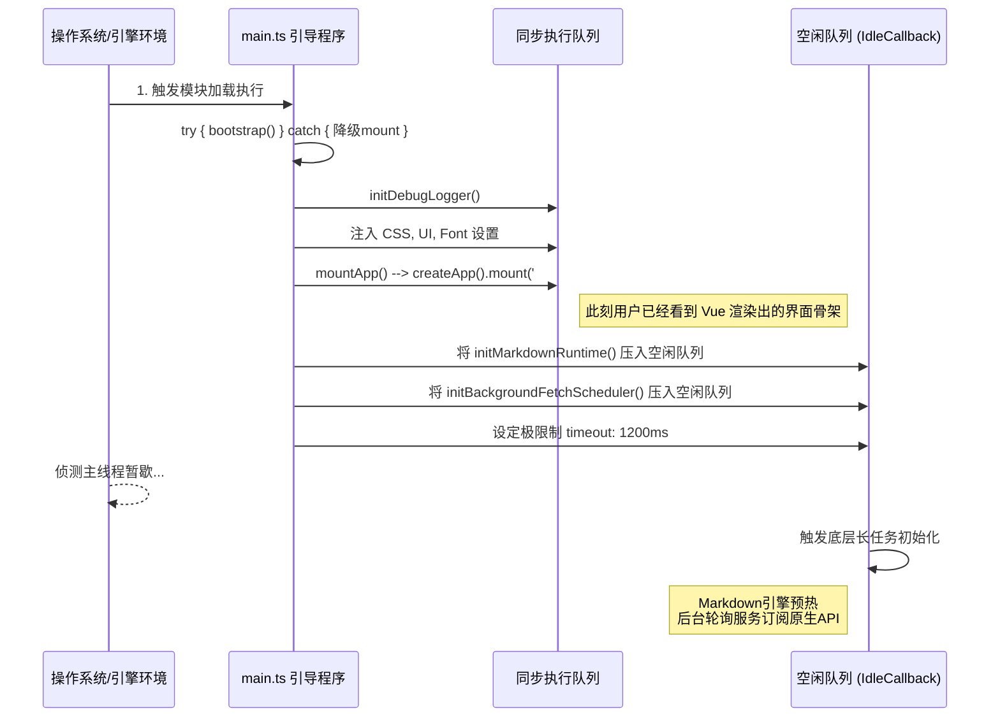

# `main.ts` 深度解析文档

## 1. 定位与核心功能
`main.ts` 是一切视图幻象的真正起搏器（Bootstrapper）。作为 Vite 构建的纯前端 `index.html` 指定首选入口点，它承担了应用启动时至关重要的**初始化拓扑编排**。

其核心功能聚焦于两大板块：
- **同步装配**：第一时间进行 DOM 探针绑定（`mountApp`），拉取必要的 CSS 初始化变量并向全局注册极其高频的基础组件。
- **异步闲时下潜**：在保障首屏极速加载（不出现安卓或桌面低性能设备“白屏”焦躁期）的前提下，将大屏、深网相关的初始化挂推迟到 `requestIdleCallback` 操作调度池中执行。

## 2. 逻辑原理与架构关联

### 2.1 同步核心装配链
```typescript
import { createApp } from 'vue'
import './style.css'
import './styles/ui_ux_pro_max.css'
import App from './App.vue'
...
const mountApp = () => {
  const app = createApp(App)
  app.component('IOSSelect', IOSSelect)
  app.mount('#app')
}
```
它首当其冲加载了全局的 CSS（确保挂载前的节点被占位并阻止闪烁）。随后生成 Vue 根实例环境，并将跨端十分常用的 `IOSSelect`（仿 iOS 滚轮选择器）推为全局可用件。这保证了业务视窗在 `mount` 命令后迅速点亮。

### 2.2 防阻塞延期加载哲学 (Deferred Initializer)
```typescript
const runDeferredInitializers = () => {
  const run = () => {
    // 处理Markdown, 后台离线通知守护进程以及 Debug_bridge 通道 
    void initMarkdownRuntime(6000)...
...
  if (typeof window !== 'undefined' && typeof window.requestIdleCallback === 'function') {
    window.requestIdleCallback(() => run(), { timeout: 1200 })
    return
  }
}
```
这部分代码是专门针对 Web 及 Capacitor (本质为浏览器进程) 多线程匮乏痛点设计的心智高地方案：
在 JavaScript 单线程模型里，若直接初始化“后台刷新池”或“构建Markdown正则匹配引擎树”，主线程长耗时卡顿会致使首部 UI 完全无响应。
所以作者利用了浏览器的游手好闲队列机制 (`requestIdleCallback`)，限定哪怕主线程再忙，也要在 1.2秒 (`timeout: 1200`) 后兜底执行掉这些长任务，从而把极其平滑的第一印象留给用户。

### 2.3 底层安全与沙盒启动 (`bootstrap`)
整个 `bootstrap` 使用了异常坚固的 `try...catch` 进行包装。因为在调用特定平台插件（如 `initUiSettings` 可能触及修改移动端的原生状态栏透明度）时，存在某些异形 Android 机型内核出错崩毁的可能。在 `catch` 到这类致命系统层打击时，代码也能顽强调用 `mountApp()` 降级为普通网页运行，力保用户仍然可用。

## 3. 代码级深度拆解：依赖生态网
通过它引入的工具库：
- `initAppSettings` / `initFontSettings`：大概率操作 DOM 顶部往 `<html/>` 标签注入类似于 `theme-mode="dark"` 或是字体替换机制。
- `initBackgroundFetchScheduler`：移动端挂起后，利用 Capacitor 的后台抓取组件进行轮询（看配置是利用系统唤醒周期偷偷探测教务后台是否有成绩更新然后 `runNotificationCheck` 弹窗叫醒用户）。
- `initDebugBridgeClient`：提供了一个后门诊断接口，可能用于在生产环境中利用内部 IPC 透传系统级错误日志到收集服务器或控制台。

## 4. 架构中的工程化挑战
这种将部分依赖挂后台（Deferred）虽巧妙，但也带来了竞争状态（Race Condition）隐患：假如用户点开应用立马跳转到 AI Markdown 对话页，此时 `initMarkdownRuntime` 如果还没在 `idleCallback` 跑完就可能导致报错甚至白屏。这要求相应的组件内部存在 `isReady` 轮询锁，这种隐性耦合需额外留意。

## 5. 启动生命周期时序流图

下面我们用 Mermaid 图表将它精湛的 **"主次双轨"** 发动机制呈装：



*(End of document)*