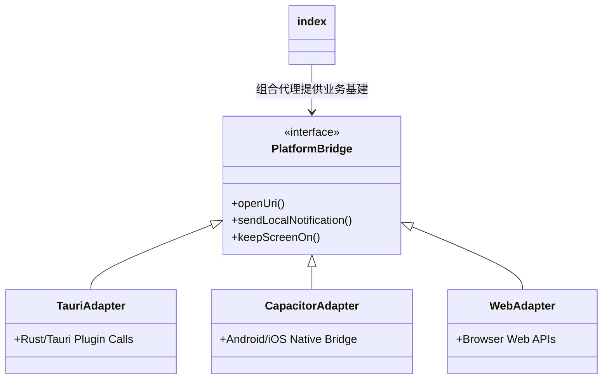

# 平台能力桥接入口 (platform/index.ts & types.ts)

## 1. 模块定位与职责

随着 App 的多端扩展（从 PC Tauri 桌面端延伸至 Android/iOS 甚至 PWA 纯 Web），前端业务层（如获取通知权限、保持屏幕常亮、打开外部链接）如果到处写 `if (isTauri) ... else ...` 将会导致代码极为冗余与不可维护。
`platform/` 目录采用了经典的 **Adapter 适配器模式**。提供了同一套标准 TypeScript 接口 `PlatformBridge`，通过 `pickBridge()` 动态依据运行环境返回不同的实现（`tauriBridge`, `capacitorBridge`, `webBridge`），实现一码多端。

## 2. 核心类型定义 (`types.ts`)

强制所有适配器都必须实现这十一个核心标准接口：
```typescript
export interface PlatformBridge {
  runtime: RuntimePlatform // 'tauri' | 'capacitor' | 'web'
  openHttp(url: string): Promise<boolean> // 打开 HTTP 外链
  openUri(target: string): Promise<boolean> // 打开深度链接 / 唤醒外部 App
  getNotificationPermission(): Promise<NotificationPermissionState>
  requestNotificationPermission(): Promise<NotificationPermissionState>
  ensureNotificationChannel(channelId: string): Promise<boolean> // 安卓 8.0+ 通知频道
  sendLocalNotification(payload: NotifyPayload): Promise<boolean>
  keepScreenOn(enable: boolean): Promise<boolean> // 屏幕常亮控制
  shareLinkOrFile(target: string, title?: string): Promise<boolean> // 唤起系统级分享
  setAggressiveKeepAlive(enable: boolean): Promise<KeepAliveState> // 后台强保活
  getAggressiveKeepAliveState(): Promise<KeepAliveState>
  openBatteryOptimizationSettings(): Promise<boolean> // 跳转电池优化设置
}
```

## 3. 动态加载决策树 (`index.ts`)

模块通过单例决策来注入当前宿主环境的桥接实现，保证前端 Vue 组件引入时是完全黑盒零感知的。



- 当业务方需要弹出本地通知提示“课表已更新”时，只需 `platformBridge.sendLocalNotification({...})`。
- 如果用户用 PC，它调 Tauri Rust 后端；如果用手机，它走 Capacitor Native API；如果是在普通浏览器里，走 HTML5 Web Notification API。真正的**Write Once, Run Anywhere.**