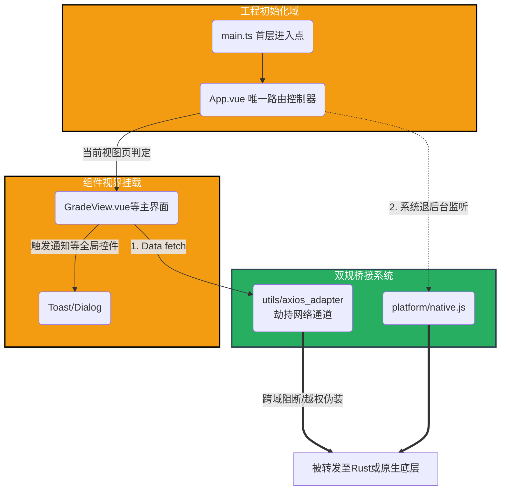

# `tauri-app/src` 文件夹全局架构与代码规范文档

## 1. 定位与全局职能

`src` 文件夹是 `Mini-HBUT` 混合应用中的**视觉表征与前端逻辑原点**。无论最后代码被 Tauri 搬上桌面，还是被 Capacitor 推送到 Android/iOS，运行在此目录下的代码都是最终接触终端用户的业务界面层。
它基于 **Vue 3 (Composition API / <script setup>)** 以及 **Vite** 驱动，担纲了数据抓取、路由切分、多端手势兼顾以及平台特异性反馈的任务。

## 2. 文件夹内部详细结构介绍

在 `src` 辖下，有着泾渭分明的工程分层。所有新增业务均需按此跨端约定归位：

### 2.1 顶级入口与挂载层
- **`main.ts`**：执行 Vite 与 Vue 的物理挂载点。主要负责建立应用生命周期，向全局注册一些特殊挂件，以及异步分流启动庞大的依赖引擎。
- **`App.vue`**：系统的**中枢神经母舰**。未采用重型 vue-router，而是直接通过 `currentView` 动态挂载各级视图。接管了应用退出拦截、热更新弹窗通知等。
- **`vite-env.d.ts`**：TypeScript 全局宏定义预处理集合。

### 2.2 UI 组件与业务视图 (`components/`)
所有的视图结构和独立 UI 器件汇聚于此。顶层组件实质上承当了页面 (Page) 的角色：
- **`Dashboard.vue` / `ScheduleView.vue` / `GradeView.vue` 等**：具体的一级和二级应用入口展示面板。
- **`AiChatView.vue` / `NotificationView.vue`**：需要重度逻辑驱动甚至 websocket/长轮询的富媒体交互组件。
- **`Toast.vue` / `UpdateDialog.vue` 等**：全局公用弹窗遮罩逻辑模块组件。

### 2.3 核心工具与跨平台桥接域 (`utils/` & `platform/`)
- **`platform/`**：底层运行态探针与跨端桥。负责向上提供一套抹平差异的原生调用接口 `invokeNative`，防止不同底层内核互相越界污染。
- **`utils/` 目录**：
  - **`api.js` / `axios_adapter.js`**：负责网络流量的安全引流或拦截代理配置。
  - **`cloud_sync.js` / `updater.js`**：掌管代码的 OTA 覆盖式更新逻辑和端云配置同步。
  - **`debug_logger.js`**：针对 WebView 或者脱机环境极难调试建立的内建防崩溃调试通道。

### 2.4 其他前端静态支持 (`assets/` & `config/` & `styles/`)
内部存放例如公共苹果级 CSS 设计语言预置项 (`ui_ux_pro_max.css`)、核心字体替换支持以及占位图表。

## 3. 架构全局逻辑原理

整个 `src` 是一个典型的**微内核胖状态设计**，极其轻量的前端路由依靠 App 自身数据响应进行销毁与替换，配合状态机管理生命周期。所有的“耗时请求网络（包括涉及教务登录验证）”几乎都在暗中被劫持并通过 Tauri Native 或 Capacitor 截获发射，确保这层界面极其专一于“UI 重绘与渲染表现层”。

## 4. 全局前端模块流转架构图

*(End of document)*