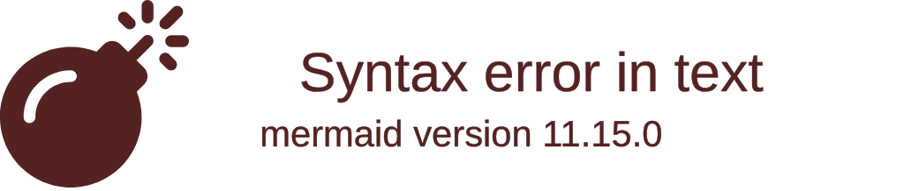

# `src/style.css` 核心系统层样式表解析

## 1. 文件概览

`src/style.css` 是整个 Vue 应用程序的基础样式基座（Base CSS）。它不包含任何特定组件的具体样式，而是通过 CSS 变量（CSS Custom Properties）将设计系统（Design System）的关键原子值（如色彩、缩放比例、阴影）挂载到全局 `:root` 上。

### 1.1 核心职责
1. **定义设计原子变量**: 使用 `--ui-primary`, `--ui-surface` 等前缀变量，作为实现动效缩放和主题切换（暗色/亮色）的动态切入点。
2. **重置与修复 (Reset/Normalization)**: 处理浏览器的默认溢出、盒模型（`box-sizing`）以及移动端令人头疼的页面皮筋效应。
3. **全局层特效绑定**: 为应用最常见的全局原子类（如毛玻璃面板 `.glass-card`、按钮 `.btn`）提供底座基础设计。

---

## 2. 样式变量架构分布图



### 2.1 架构深度解读

#### a. 动态度量标尺 (Dynamic Scale Units)
```css
  --ui-radius-scale: 1;
  --ui-font-scale: 1;
  --ui-space-scale: 1;
  --ui-motion-scale: 1;
```
这是一种极为前沿的样式设定。相比于直接写死 `16px` 或者 `0.3s`，这里的基座暴露出了一系列**乘数因子**。通过 JavaScript 修改 `:root` 的 `--ui-space-scale`，系统可以不仅在一瞬间变成“紧凑版”或“宽大版”UI，还能让那些晕车/晕3D的用户将 `--ui-motion-scale` 调低至 0 来完全关闭系统的花哨动画。

#### b. 毛玻璃与渐变环境底座
```css
.glass-card {
  background: var(--ui-surface);
  backdrop-filter: blur(12px);
  border-radius: calc(16px * var(--ui-radius-scale));
}
```
利用现代 Web 绘图引擎的特性，系统大规模抛弃了实心背景。采用了具备透明通道的 `rgba` 和 `backdrop-filter: blur` 的配合，形成了高级的毛玻璃系统。这个基础类将会被用在整个程序包括登录框、课表卡片等等一切视觉焦点上。

#### c. 防止 PWA / 移动端越界弹跳
```css
html, body {
  overflow: hidden;
  overscroll-behavior: none;
}
```
当系统被打包成为移动端或者用户用力下拉页面时，原生浏览器会触发刷新行为或产生丑陋的留白。`overscroll-behavior: none` 是锁死 Webview 容器使其表现得像真正 iOS/Android 原生 Native 应用必须拥有的关键声明。