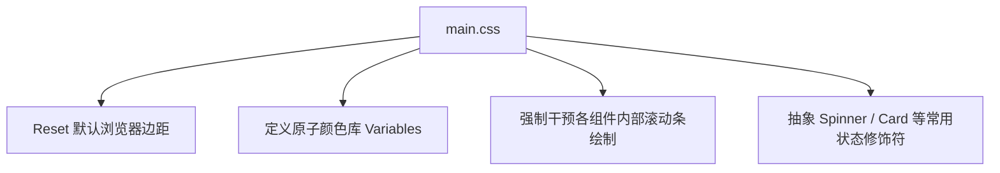

# 全局基础样式基座 (main.css)

## 1. 定位与边界

`main.css` 是项目初期搭建时最基础的层级（Level 1）样式文件。它的核心目标是确立基础的 CSS Reset（重置）、规范盒模型设定（Box-Sizing），并注入第一套标准化的状态颜色盘体系。

## 2. 托底色盘结构 (Color Palette)

文件顶部采用了一套非常标准的 Tailwind-like 色板定义，这套色板即使在没有引入现代化工具链的前提下，也能支撑简单的黑白状态呈现：

```css
:root {
  --primary: #667eea;
  --primary-dark: #764ba2;
  --success: #10b981;
  --warning: #f6ad55;
  --danger: #e53e3e;
  --info: #3b82f6;
  --gray-200: #e5e7eb;
}
```

## 3. 全局滚动条覆写与原子类

系统强制接管了 Chromium 环境下的滚动条 `.webkit-scrollbar` 渲染指纹：
```css
::-webkit-scrollbar {
  width: 8px; /* 极薄像素 */
}
::-webkit-scrollbar-thumb {
  background: var(--gray-300);
  border-radius: 4px;
}
```
此外定义了 `.card`、`.btn`、`.spinner` 等最核心的原子级复用 CSS。对于不支持强力打包的旧业务，可以直接通过 className 引用这些骨架。


这是全站样式的绝对底座。