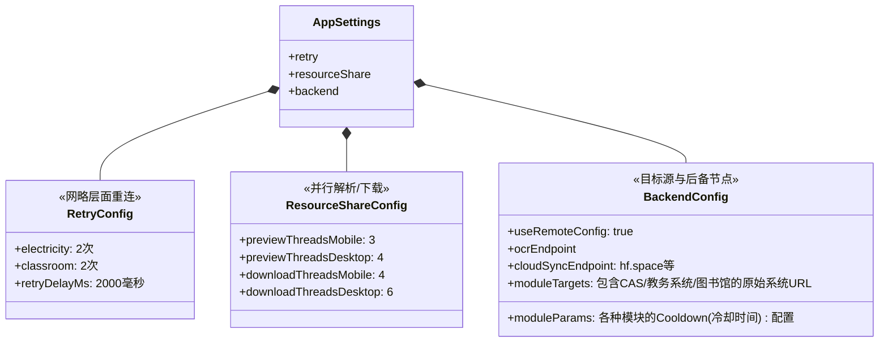
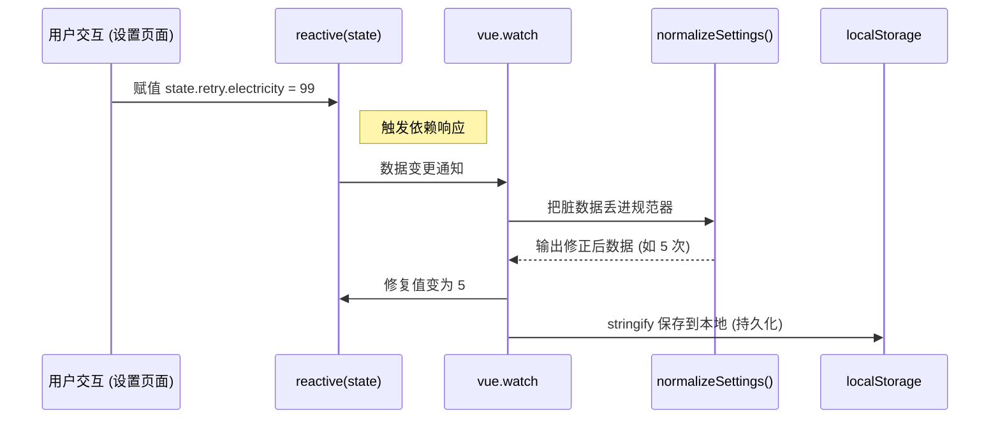

# 应用配置持久化与标准化管理 (app_settings.ts)

## 1. 模块定位与职责

`app_settings.ts` 是全局运行时参数的管控中心，主要负责应用连接服务端 OCR、代理层、云同步及一些基础网络行为和重试策略的读取与设定。
由于 Tauri（桌面端）与 Capacitor（移动端）运行时环境差异大，网络状况不稳定，应用引入了复杂的**超时控制、重试机制和多线程并发数量限制**，这些均由大单例的 `useAppSettings()`（内部基于 Vue3 `reactive`）提供。

## 2. 状态结构与默认层级

该模块定义了一套深度嵌套的配置对象 `DEFAULT_SETTINGS`。其中对爬虫参数、多线程以及远端基址做了严格要求。



## 3. 核心机制解析

### 3.1 严格类型与边界收束 (Clamp Normalization)
这部分代码对存入 localStorage 和外部传入的快照数据进行了严密的校验。
例如 `clampNumber` 函数，确保了即使用户手动通过 DevTools 恶意篡改本地存储，配置依然回退到合法范围：
```javascript
const clampNumber = (value, min, max, fallback) => {
  const num = Number(value)
  if (Number.isNaN(num)) return fallback
  return Math.min(max, Math.max(min, num)) // 强制规范到区间内
}

// 实际使用示例，限制安卓图片并发下载数不能超过 8
next.resourceShare.downloadThreadsMobile = clampNumber(
    next.resourceShare.downloadThreadsMobile,
    1, 8, base.resourceShare.downloadThreadsMobile
)
```
同时包含了用于安全转换 URL 的 `normalizeUrl`（例如将 `localhost:8080` 自动矫正为 `http://`，公网域名自动变 `https://` 并去空格）。

### 3.2 响应式热拔插 (Watcher Sync)
模块导出并不是简单的方法导出，而是将 Vue 的 `reactive` 包装暴露。并在初始化时 (`initAppSettings`) 构建了针对此对象的 Deep Watcher。

一旦上层的 “偏好设置页” (Setting.vue) 使用 `useAppSettings().resourceShare.xxx = 9` 修改了值，Watcher 会：
1. 立马拦截到变化
2. 调用 `normalizeSettings()` 重新对新值进行界限清理
3. 若值被 clamp 调整，将**修正后的值反写回 state**
4. 序列化 `JSON.stringify` 异步存入 `localStorage('hbu_app_settings_v1')`



## 4. 应用级配置导入快照
本系统常常具有 `Remote Config`（远端自动下发热更）的情况，所以提供了 `applyAppSettingsSnapshot(raw)` 来一键整体覆盖和刷新所有状态：
不仅涵盖了核心网络超时 `requestTimeoutMs`, `probeTimeoutMs`，还对云端同步 `cloudSyncCooldownSec` 的各个冷却周期予以映射。
这些参数通常通过 `import { useAppSettings } from '@/utils/app_settings'` 提取并在 axios_adapter 或者 scraper 工具类中使用。