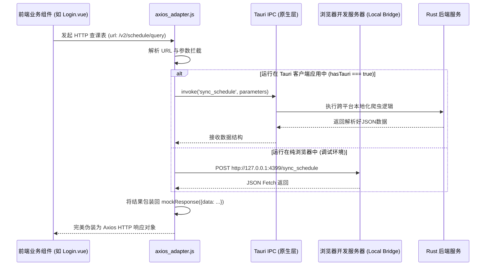

# Frontend API 通信与底层桥接适配器解析 (axios_adapter.js)

## 1. 模块定位与职责

`axios_adapter.js` 是 Vue 3 前端应用与 Tauri (Rust) 后端进行数据交换的**核心拦截器与适配器**。

由于历史原因，前端最初使用的是 Axios 直接请求 Web API。在重构为 Tauri 桌面/移动多端架构后，为了**不修改上层业务组件中的 Axios 请求代码**，开发了本模块。
该适配器拦截所有传统的 HTTP (GET/POST) 请求，并根据运行环境将其**分流**：
1. **Tauri 原生环境**：使用 `@tauri-apps/api/core` 的 `invoke` 方法，通过 IPC（进程间通信）调用 Rust 核心库。
2. **本地浏览器开发环境**：将请求重定向到 本地 Web Server (如 `http://127.0.0.1:4399`) 以进行调试跨域桥接。

## 2. 核心架构原理图



## 3. 核心设计模式与实现逻辑

### 3.1 环境嗅探器与兜底协议
模块顶部直接导入了 native 的 `isTauriRuntime` 判断:
```javascript
const hasTauri = isTauriRuntime();
const LOCAL_BRIDGE = 'http://127.0.0.1:4399';
const BRIDGE_BASE = hasTauri ? LOCAL_BRIDGE : '/bridge';
```
如果当前运行在浏览器，就会将请求发送到本地 4399 端口，保证开发者脱离 Tauri 的环境仍能调试页面 UI。

### 3.2 响应伪装 (Mocking Axios)
这使得所有的 vue 组件能以 `res.data` 一如既往地解开数据。
```javascript
const mockResponse = (data) => ({
    data,
    status: 200,
    statusText: 'OK',
    headers: {},
    config: {}
});
```

### 3.3 路由表隐式分发
适配器包含一个庞大的 `get` / `post` switch/if-else 路由表。将以往后端的 API 隐射到本地 RPC Command。

*   `/v3/login_params`: 映射为 `invoke('get_login_page')`
*   `/v2/start_login`: 映射为 `invoke('login', { username, password... })`
*   `/v2/schedule/query`: 映射为 `invoke('sync_schedule')`
*   `/v2/qxzkb/options`: 映射为 `invoke('fetch_qxzkb_options')`
*   `/dormitory_data.json`: 被判定为纯静态资源，**直通放行使用原生的 fetch** 请求。

## 4. 关键接口行为备忘

### A. 密码加密预设
根据 `axios_adapter.js` 中的开发者长段注释以及代码走查判断：
在请求到达 `invoke('login')` 之前（比如在旧架构中），由于教务系统有密码变种机制，原本计划是在 Node.js/Python 做的 AES 预加密，在 Tauri 生态里**转移到了 Rust 里实现（亦或者在 Login 组件提交前执行 AES）**。此处直接透传 `data.password`，依赖上层或者底层正确的处理协议约定。

### B. 验证码图形清洗
```javascript
if (url.includes('/v3/refresh_captcha')) {
    const imgBase64 = await invoke('get_captcha');
    // Rust Tauri command returns "data:image/png;base64,..."
    // Adapter needs to strip prefix for frontend component expectation.
    const parts = imgBase64.split(',');
    const base64 = parts.length > 1 ? parts[1] : parts[0];
    return mockResponse({ success: true, captcha_base64: base64 });
}
```

### C. 桥接拆解 (unwrapBridge)
为了防止后端返回的 JSON 已经被嵌套了 `{ data: { ... } }` 而加上外层 mockResponse 导致前端产生 `res.data.data.body` 式深渊调用，专门书写了 `unwrapBridge` 以抹平嵌套层级冲突。