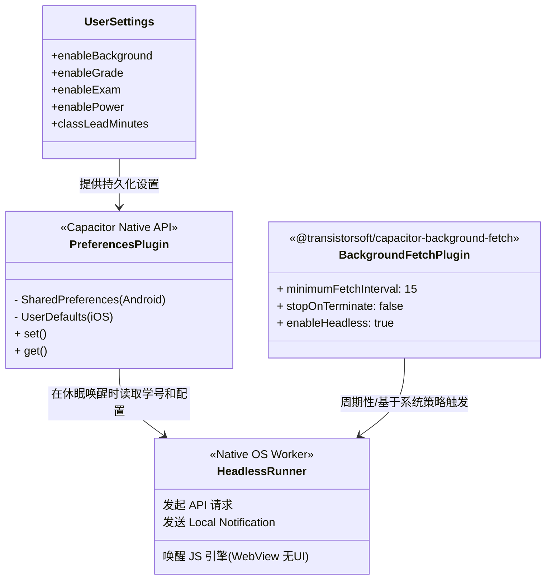
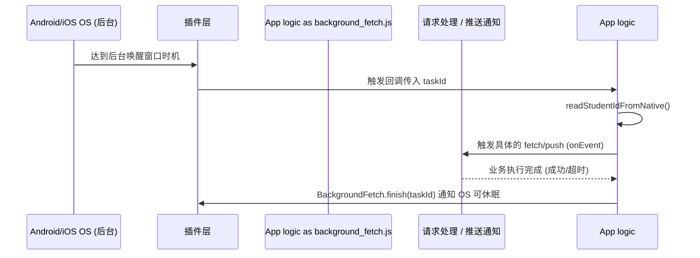

# 后台刷新与推送任务调度器 (background_fetch.js)

## 1. 模块定位与职责

`background_fetch.js` 是专为**移动端环境（Capacitor）**设计的后台任务调度器模块。
由于成绩查询、电费预警、上课提醒等功能需要在 App 被挂起甚至杀死后仍能继续运行（Headless 模式），普通的 `setInterval` 会被移动操作系统（iOS/Android）挂起。
因此，该模块引入了 `@transistorsoft/capacitor-background-fetch` 和 `@capacitor/preferences` 进行底层状态持久化与系统级后台任务唤醒。

## 2. 核心架构与状态持久化图解



## 3. 核心功能实现分析

### 3.1 环境鉴权与存储同步 (`syncBackgroundFetchContext`)
因为在 Headless（无头后台）模式下，原有的 Vue store（如 Pinia）或是 Vue 组件都不会被加载，甚至 `localStorage` 可能也会受限于 WebView 生命周期。所以为了让后台任务能拿到关键状态：
```javascript
export const syncBackgroundFetchContext = async ({ studentId, settings, dormSelection } = {}) => {
  // 只在 capacitor 移动端环境下生效
  if (getRuntime() !== 'capacitor') return;
  const Preferences = await getPreferences();
  
  // 将 Vue 层面的状态强行写入到底层的 Preferences 中
  await Preferences.set({ key: PREF_KEYS.studentId, value: sid });
  await Preferences.set({ key: PREF_KEYS.enableBackground, value: config.enableBackground ? '1' : '0' });
  // ... 写入学号、轮询间隔、电费宿舍等信息
}
```

### 3.2 系统级任务调度器 (`initBackgroundFetchScheduler`)
这是使得 App 即便在后台或杀死状态（依赖不同操作系统的白名单与省电策略）也能运行的核心。

*   **配置属性解释**：
    *   `minimumFetchInterval: 15`：期望至少15分钟唤醒一次（实际受 iOS/Android 系统调度策略限制，不一定精准）。
    *   `stopOnTerminate: false`：在用户手动划掉杀后台后，**不停止**任务，由系统 Service/JobScheduler 保活。
    *   `startOnBoot: true`：开机自启。
    *   `enableHeadless: true`：支持完全无 UI 的 JS 唤醒。
*   **Android 强提醒补充机制**：
    额外调用了 `BackgroundFetch.scheduleTask` 注册了一个命名为 `com.hbut.mini.notify.periodic` 的 `forceAlarmManager: true` 周期任务。这使用 AlarmManager 进行更强制的唤醒，避免被 Android 的 Doze Mode 深度睡眠扼杀。

### 3.3 任务执行流程图 (`invokeFetchEventHandler`)



### 3.4 运行时状态与降级诊断 (`getBackgroundFetchRuntimeState`)
开发了详细的状态观测方法用于设置页面诊断。如果是 Tauri（PC 端），这个功能被退化为 `foreground-interval` (单纯靠前台的 `setInterval` 保持刷新，因为 PC 端一般不存在被强杀后台的问题)，若是 Capacitor 则会返回具体的系统可用码（`status === BackgroundFetch.STATUS_AVAILABLE`）。