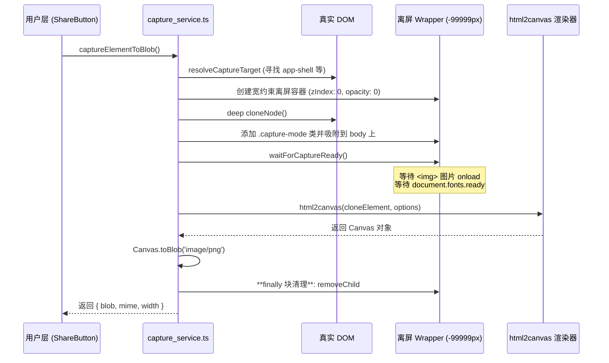

# 前端 DOM 截图与长图生成服务 (capture_service.ts)

## 1. 模块定位与职责

`capture_service.ts` 是负责将前端网页（DOM）转化为图片的工具模块。
由于成绩客户端需要支持**一键导出课表**、**生成成绩单分享图**，这些页面往往超出手机屏幕，或是包含很多异步加载的资源/动态 CSS。该服务封装了 `html2canvas` 库，并建立了一套从环境准备、资源等待、离屏渲染到 Canvas/Blob 输出的健壮管线。

## 2. 截图生命周期架构图



## 3. 核心机制设计与防御性编程

### 3.1 离屏深拷贝渲染 (Offscreen Rendering)
为了不让截图影响到用户的真实可视区域（例如截图时会有极短瞬间网页闪烁，或者部分元素在截图专门显示的逻辑），工具会先将要截图的目标深度克隆一份（`cloneNode(true)`），将其置于 `left: -99999px` 的绝对隐秘角落。
同时，给克隆节点加上名为 `.capture-mode` 的 CSS Class。这就允许部分 CSS 只在导出时才会应用：
```css
/* 开发时定义的例子 */
.hide-in-screenshot { display: block; }
.capture-mode .hide-in-screenshot { display: none !important; }
.capture-mode .export-watermark { display: block !important; }
```

### 3.2 资源加载死锁回避 (`waitForCaptureReady`)
`html2canvas` 经常会因为网络请求的图片还未渲染，或者自定义 Web Font 尚未下载完毕导致最终的截图乱码走样或者有大量空白。
该工具加入了强制资源同步原语：
1. **字体等待**：`await fonts.ready` (有异常吞锁保护)。
2. **图片等待**：找出根所有 `img`，利用 `Promise.all` 给它们都挂上 `{ once: true }` 的 `load` / `error` 事件。
3. **渲染帧补偿**：连续调用两次 `requestAnimationFrame`，强制确保所有 DOM 计算重绘完成。

### 3.3 降级渲染机制 (Foreign Object Fallback)
现代 Vue 项目（特别是该客户端由 `style.css` 驱动）有许多复杂的 CSS 函数支持，如 `oklab`、`color-mix`。但老版本的 `html2canvas` 在解析这类 CSS 语缀时会报错崩溃。
为了避免功能瘫痪，加入了一层级联容错：
```javascript
  try {
    return await html2canvas(element, baseOptions)
  } catch (error: any) {
    // 探测到因 oklab 或最新 CSS 导致解析引擎失败时
    if (/unsupported color function|oklab|color-mix/i.test(message)) {
      // 开启 foreignObjectRendering 再次尝试渲染 (浏览器级别绘制而非纯 JS 绘制)
      return html2canvas(element, {
        ...baseOptions,
        foreignObjectRendering: true, 
        backgroundColor: null
      })
    }
  }
```