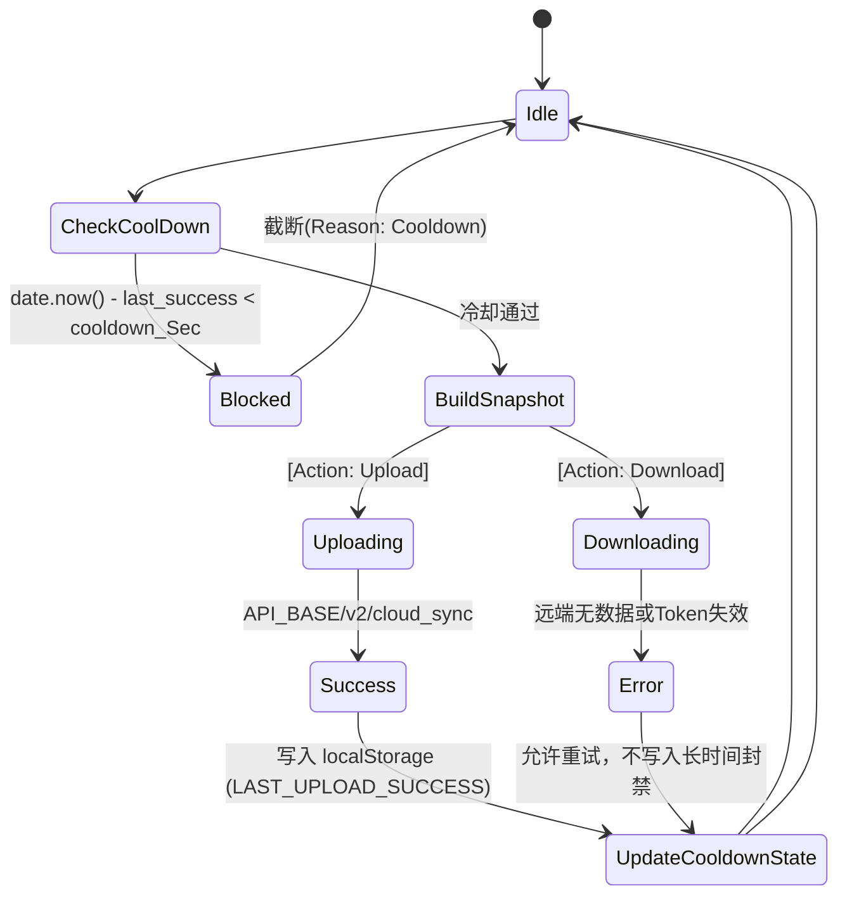

# 云端数据热备与全量同步引擎 (cloud_sync.js)

## 1. 模块定位与职责

`cloud_sync.js` (云同步引擎) 是确保跨端、跨设备用户数据不会因为本地存储 (localStorage/SQLite) 清除或重新登录而丢失的关键基石模块。
由于纯粹的前端应用可能只是一个无状态的 WebView，而用户又期望保留离线课表、手动修改的课表标注 (Custom Courses) 以及历史成绩缓存等数据，因此系统设计了该 Cloud Sync 机制，定期且增量地向私有云网盘或 HF Space (HuggingFace 免费部署的代理侧) 推送快照。

## 2. 同步状态机与冷却管理

为了防止用户频繁点击“强制同步”压垮免费的云端容器，或者在后台自动拉取死循环。模块定义了严格基于时间戳的防抖冷却 (Cooldown) 状态：



## 3. 核心机制设计

### 3.1 指纹溯源系统 (Fingerprint & Versioning)
缓存是以 `cache:xxxx:studentId` 保存在本地的，它是一个扁平化的 KV 结构。
要进行同步前，需要**构建全局快照**(`buildGradeSnapshot`, `buildRankingSnapshot`)，遍历收集各种带有后缀（如学期 `2023-2024-1`）的 Cache Key。
对于历史成绩同步，最难解决的是结构变迁去重。模块对每条明细数据提供了一套哈希指纹：

```javascript
const makeGradeFingerprint = (item, semester = '') => {
  // 从多种脏数据字段中正则剥离
  const sem = toSafeText(semester) || deriveGradeSemester(item)
  const name = toSafeText(item?.course_name || item?.name || item?.kcmc)
  const score = toSafeText(item?.score || item?.final_score || item?.zcj || item?.cj)
  const credit = toSafeText(item?.credit || item?.xf || item?.course_credit)
  const code = toSafeText(item?.course_code || item?.kch || item?.id)
  
  // 组装不可反演但唯一的字符串
  return `${sem}|${code}|${name}|${score}|${credit}`
}
```
凡是指纹撞车的成绩项，如果在缓存提取过程中合并时会遭到剪裁(`seen.has(fp)`)，保证推送到云端永远是去重的最小体积集合。

### 3.2 自定义课程隔离收集 (`fetchAllCustomCourses`)
除了教务系统的正规课程，用户手动添加的考研辅导班等课程不会包含在原生缓存快照内。
该模块利用 `axios` （或者由于是 Tauri 本地的话，走 axios adapter 隐式映射给 Rust）发起虚拟请求 `api/v2/schedule/custom/list`。将所有手工修补数据也整合进云端包内。

## 4. 远程下发设置 (Remote Config Hook)
注意到 `cloud_sync.js` 依赖于 `app_settings`，其本身其实又是一个远控中心。
`getCloudSyncRuntimeConfig()` 甚至能从远端下发的最新的 JSON 配置里读取 `cooldownSec` 和 `proxyEndpoint`（如果当前云同步后端死掉，开发者更改了云端存储库域，应用能自我发现并接驳到新域名上，具有强健的自愈能力）。