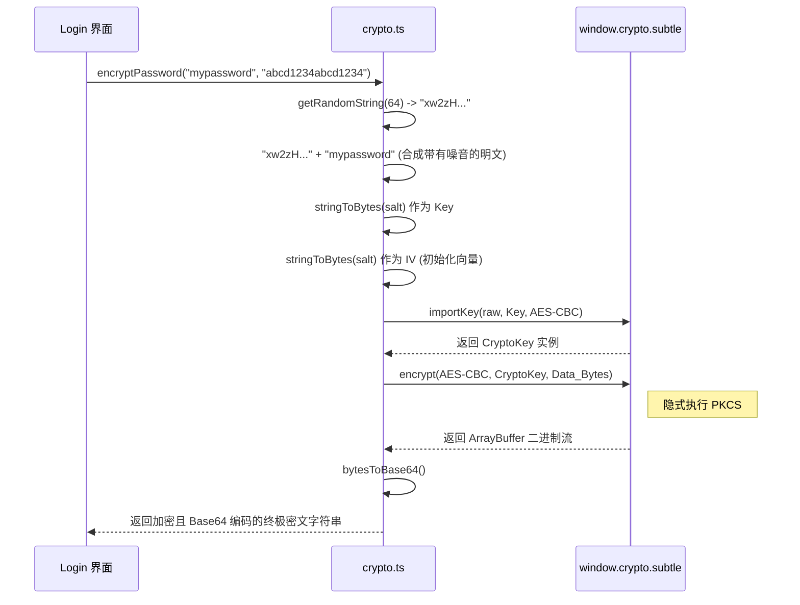

# CAS 登录密码 AES 加密工具 (crypto.ts)

## 1. 模块定位与职责

`crypto.ts` 是专属服务于教务系统 CAS (Central Authentication Service) 登录的核心安全模块。
在此前 Rust `http_client.rs` 端并未将密码做 AES 处理的遗留架构里，前端表单通过挂载本工具预先将密码“混淆加盐”成密文后再传递至底层或远端爬虫服务器。该逻辑**精细逆向并 100% 还原了**学校官网 `encrypt.js` 内的加密混淆原语。

## 2. 算法机制与加密流水线

### 2.1 盐值 (Salt) 和 IV 的分配
统一认证系统在拉取 `v3/login_params` （登录表单第一页）时会返回一个 16 位的动态 `salt`，并且要求以此变量**同时作为 AES 密钥 (Key) 与初始向量 (IV)**。

### 2.2 变长前缀抖动 (Random Prefix Obfuscation)
为了防御抓包特征和重放分析，学校系统采用在明文密码前追加固定长度 (`64`位) 伪随机字符串的设计：
```text
Final_Plaintext = [64 bytes Random String] + User_Password
```

### 2.3 加密流程图



## 3. Web Crypto API 调用要点

由于为了保持极低体积并没有引入额外的库 (如 `crypto-js`)，而是纯依赖现代浏览器的 `window.crypto.subtle` （即 Web Crypto API）。由于原生态 API 基于 Promise 和 ArrayBuffer 进行高度底层的操作，代码里编写了辅助映射：
1. **`stringToBytes`**：依托 `new TextEncoder().encode()` 转换 UTF-8。
2. **`bytesToBase64`**：手写了将 Uint8Array 逐字节转换为 `fromCharCode`，再走浏览器原始的 `btoa` 以支持宽字符二进制转换为可视字母。

## 4. 安全断言 (Assertion)
```typescript
if (!salt || salt.length !== 16) {
    throw new Error('加密盐值无效')
}
```
AES-CBC 对于参数长度有极为严格的要求，若是不足 16 Byte（128 Bit），会导致底层底层加解密库崩溃或内存越界，此处必须做了前置拦截。