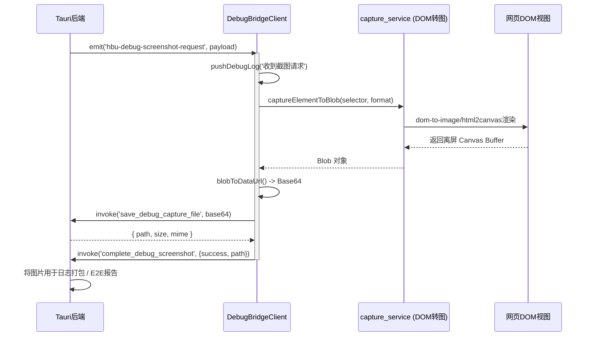

# 调试截屏导航桥接中心 (debug_bridge.ts / debug_bridge_client.js)

## 1. 模块定位与职责

该模块是为 PC 调试或 Tauri 原生外壳提供与前端 DOM 进行深度交互的“桥接器（Bridge）”。
它可以监听特殊的系统级事件（如 `hbu-debug-screenshot-request`），直接指挥前端浏览器层生成 DOM 网页截图，或是触发路由跳转。常用于反馈模块打包系统日志时附带当前屏幕截图，或者用于 E2E 测试中的快照自动化。

## 2. 核心架构与事件通信

采用双向通信：
- **下行指令**：响应原生的 `eventApi.listen`，处理 `screenshot` 与 `navigate` 请求。
- **上行汇报**：通过 `invokeNative` 将生成的截图 Base64 数据返回 Rust 进行本地落盘。



## 3. 核心功能解析

### 3.1 截图桥接器 `SCREENSHOT_EVENT_NAME`
监听 `hbu-debug-screenshot-request`。
- **格式控制**：支持通过 `payload.format` 控制 WebP 还是 PNG。
- **防阻塞处理**：内部包覆了 `try...catch`，无论 `captureElementToBlob` 出错与否，都会调用 `complete_screenshot` 告知原生层“截图结束”，避免原生层无限阻塞等待。

### 3.2 导航跳跃器 `NAVIGATE_EVENT_NAME`
监听 `hbu-debug-navigate-request` 事件用于被动修改界面的 URL Hash，进而触发 Vue Router 响应：
```typescript
const resolveDebugHash = (sid: string, view: string) => {
  // 校验 sid 是否为10位学号格式
  if (!/^\d{10}$/.test(normalizedSid)) return '#/'
  if (normalizedView === 'home') return `#/${normalizedSid}`
  return `#/${normalizedSid}/${normalizedView}`
}
```
结合了 `localStorage.getItem('hbu_username')` 的降级策略，使得如果在没有传递学号的情况下，默认使用当前已登录用户的学号，保障路由成功拼装。

## 4. 生命周期管理（避免内存溢出）

在模块初始化 `initDebugBridgeClient` 时，绑定了 Tauri 窗口卸载钩子 `window.addEventListener('beforeunload')`。
卸载时，会严格执行：
1. 释放 `unlistenScreenshot` 侦听。
2. 释放 `unlistenNavigate` 侦听。
3. `invokeNative('set_debug_bridge_ready', { ready: false })` 告知底层“宿主环境死亡，暂停调试”。