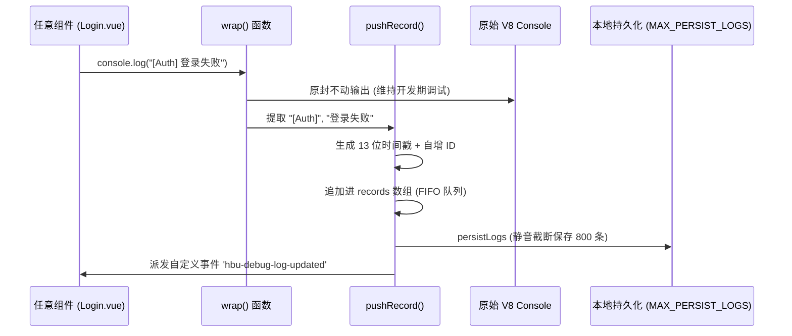

# 调试日志中心与 Fetch 劫持器 (debug_logger.ts)

## 1. 模块定位与职责

`debug_logger.ts` 是为解决移动端 Webview（Capacitor 等）和桌面发行版 (`Tauri`) 无法直接弹出 F12 开发者工具进行调试而诞生的**内存级日志引擎**。
它通过运行时补丁 (Monkey Patch)，静默劫持了全局的 `console.log` 方法以及 `window.fetch` 方法，并且维护了一定条数（默认 1200 条）的滚动存储，便于前端 UI（如 Debug 页面或者报错反馈邮箱）直接读取渲染。

## 2. 日志捕获架构

### 2.1 控制台污染与代理 (Patch Console)
为了不让旧有代码和第三方库失效，本工具在内部保留了原始的 `console.xx` 引用，并进行了高阶函数包装：



### 2.2 网络层透明拦截 (Patch Fetch)
类似于 Axios Interceptor，但作用于更底层。
```typescript
const patchFetch = () => {
    const nativeFetch = window.fetch.bind(window)
    window.fetch = async (input, init?) => {
        // 请求发起到响应，中间自动植入 pushRecord("debug" / "info" / "error")
    }
}
```
这样做的好处是无论是采用 `axios` 的旧模块，还是使用原生 `fetch` 请求 OSS 图片资源的新组件，所有 HTTP 动向都将在本地系统日志库中留存一条“包含耗时 `(Date.now() - start)ms` 和 HTTP Status” 的白盒证据。

## 3. 存储水位与持久化控制
由于日志如果不加限制会快速吃满 `localStorage` 导致致命报错 `QuotaExceededError`：
- 定义了双轨制配额：`MAX_MEMORY_LOGS = 1200` （内存数组容量） 和 `MAX_PERSIST_LOGS = 800` （硬盘落地容量）。
- 运用高频率覆写的切片 `records.slice(-MAX_PERSIST_LOGS)` 淘汰过期日志记录。由于前端性能在 V8 引擎下极佳，简单的切片比复杂环形队列更加工程实用。

## 4. Vue 集成
任何组件只需 `import { initDebugLogger, pushDebugLog } from './debug_logger'`。该系统是单例模式单次挂载（通过 `initialized` 标量拦截），保证全局 Console 被劫持唯一一次。