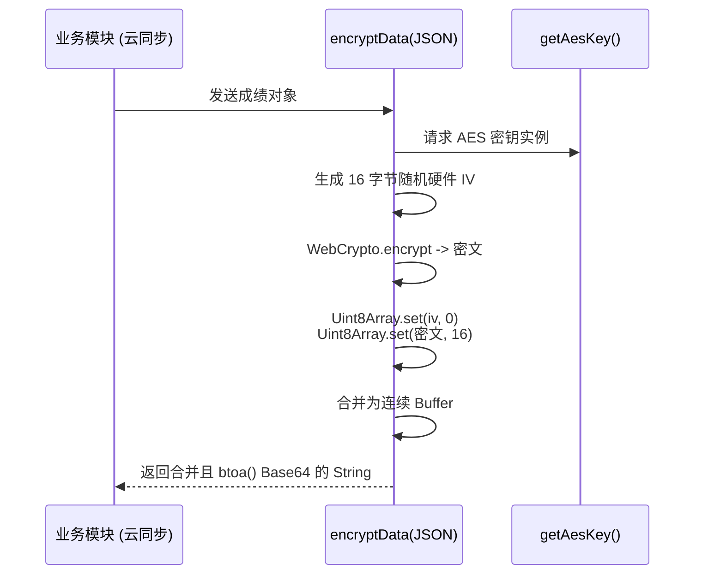

# 前后端双向通用数据保护与载荷握手模块 (encryption.js)

## 1. 模块定位与职责

`encryption.js` 不同于专门用于破解学校表单 `CAS` 登录的 `crypto.ts`，这个模块是专门设计来服务于**应用自有后端通信**（比如连接 `cloud_sync.js` 同步的云侧服务器时保护成绩隐私）。
它默认使用硬编码预共享密钥 (PSK, Pre-Shared Key)：`hbu_grade_secret_key_2026`，为前后端的 JSON 荷载提供对称加密墙。

## 2. 核心加密范式

该实现依然彻底拥抱了浏览器环境的轻量原生 `window.crypto.subtle` API，采用标准的 **AES-256-CBC** 加密体制和 **16-byte 动态 IV。**

### 2.1 密钥扩展 (Key Derivation)
为了让纯字符串满足 AES-256 需要的 32 字节高熵密钥要求，引入了 SHA-256 摘要：
```javascript
  const encoder = new TextEncoder();
  const data = encoder.encode('hbu_grade_secret_key_2026'); // Secret Key
  const hashBuffer = await crypto.subtle.digest('SHA-256', data); // 扩展成高质量的 AES 原材料
```

### 2.2 载荷打包架构图

前端加密打包的过程中，将生成的动态 `IV(16 bytes)` 紧贴在 `Ciphertext`(不规律长度密文) 之前形成合并字节流，并整体抛给 `btoa` 转成 ASCII 文本传往网络。解密端则定长截断第一段。




## 3. 防脑裂设计 `getKeyHint()`

在应用进行大重构（比如跨越2026年）更换全局通信密钥时，如何确认正在连接的后端服务器和移动端的版本是不是用着一样的密码？
设计了一个 `getKeyHint()` 方法用于打招呼验证：
```javascript
const hashBuffer = await crypto.subtle.digest('MD5', data);
return hashArray.map(b => b.toString(16).padStart(2, '0')).join('').slice(0, 8);
```
将当前使用的密钥采用不支持碰撞防伪的 MD5 进行极其快速的短摘要切片，取前 8 位 Hex。类似于 PGP 公钥的指纹显示，只用于版本鉴定或者握手对比，非常精妙。

## 4. 与 crypto.ts 的本质区别

*   `crypto.ts`：为教务系统单向伪装服务，使用服务器给出的动态盐作为 Key，前面拼接随机无意义前缀混淆，无需还原（也不可能）。
*   `encryption.js`：为全量隐私数据（如历年成绩 Json）双向收发设计，有明确的解密还原逻辑 (`decryptData`)。依赖静态预配置安全密钥，使用标准 `IV+密文` 混合包结构。