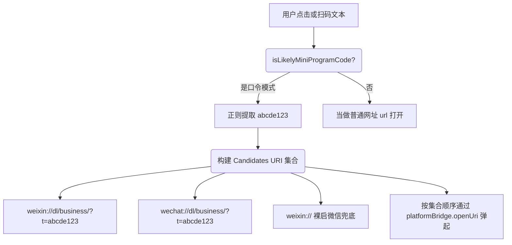

# 外链识别与拉起策略路由器 (external_link.ts)

## 1. 模块定位与职责

`external_link.ts` 用于处理 App 内所有的点击链接跳转动作。
特别针对于学校经常下发的“微信小程序口令”和复杂的 `weixin://dl/business` Deep Link 进行了深度正则提取和多路降级轮询机制。保证无论是在 Tauri 桌面上，还是在 iOS/Android 上都能尽可能唤醒对应的 App（比如微信和浏览器）。

## 2. 小程序唤醒启发式推断 (Heuristics)

为了支持直接解析字符串如：`#小程序://教务查询/abcde123` 并将其换算为 `scheme`：

如果是 `AppId` 形式的小程序路由（`appId: wx123, path: /pages/`），它也会进行全面的组合编码转换生成。这极大提高了由教育局或辅导员发布的活动的小程序打开成功率。