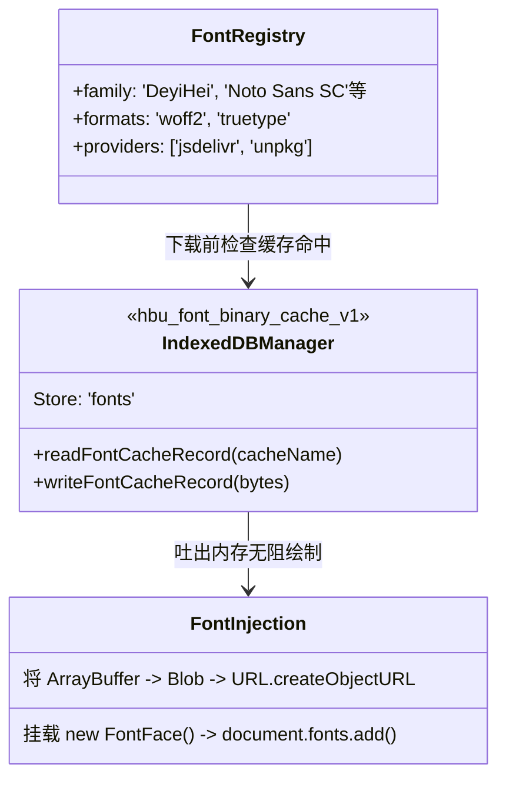

# 动态字体加载与 IndexedDB 持久化系统 (font_settings.ts)

## 1. 模块定位与职责

由于中文字体（如黑体、宋体包）动辄 10MB-30MB，如果直接打包进 App，体积将膨胀巨大。
本模块引入了一套动态字体分发机制，支持用户在设置中选择不同字体集。在加载时使用 CDN 或者 Tauri 原生方法获取字体，并将其以 `ArrayBuffer` 二进制落盘至前端本地数据库 `IndexedDB` 达成秒级预加载。

## 2. 状态结构与 CDN 流转

## 3. Web API 的交叉使用
- **`IDBDatabase`**: 通过原生的 `indexedDB.open` 手工接管二进制数据 `Uint8Array`，规避了 LocalStorage 对 5MB 且只能存 String 的天然短板。
- **`FontFace Web API`**: 在获得字体缓冲后，并不通过操纵 DOM `<style>` 实现加载，而是调用原生的 `document.fonts.add(new FontFace(...))` 获得更精确的异步事件管控和重排消除。