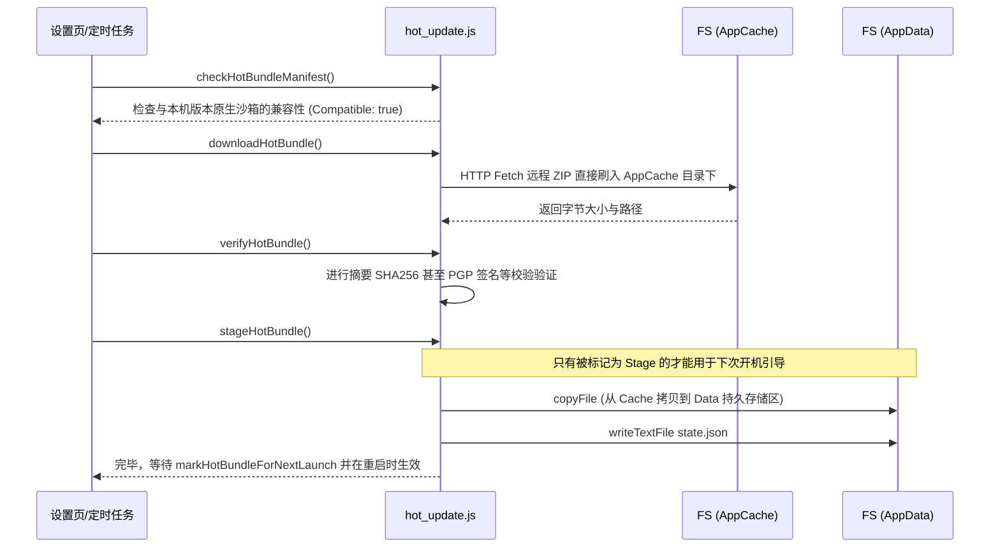

# 基于插件层的本地热更新编排网关 (hot_update.js)

## 1. 模块定位与职责

该文件是在 Tauri 环境中执行 **热更新（OTA / Hot Update）** 资源包下载与存储阶段的高级暴露层。
它完全依赖于 `@tauri-apps/plugin-fs` 来操作原生文件系统（创建隐藏的 Downloads & Bundles 目录，写入二进制 Zip、记录 State）。不承担哈希或签名的底层算法计算，只负责把控流程并将状态序列化落库。

## 2. 热更新包落地管线策略

定义了极其严谨的 `BaseDirectory.AppCache`（临时存续）和 `BaseDirectory.AppData`（持久生效）的数据分流策略。

这种双层目录（下载校验区与驻留激活区）隔离了“下载一半断网”、“下载完毕但文件被篡改”等边角案导致开机白屏的严重事故。只有经历了 `Stage` 步骤的文件才算可信负载。