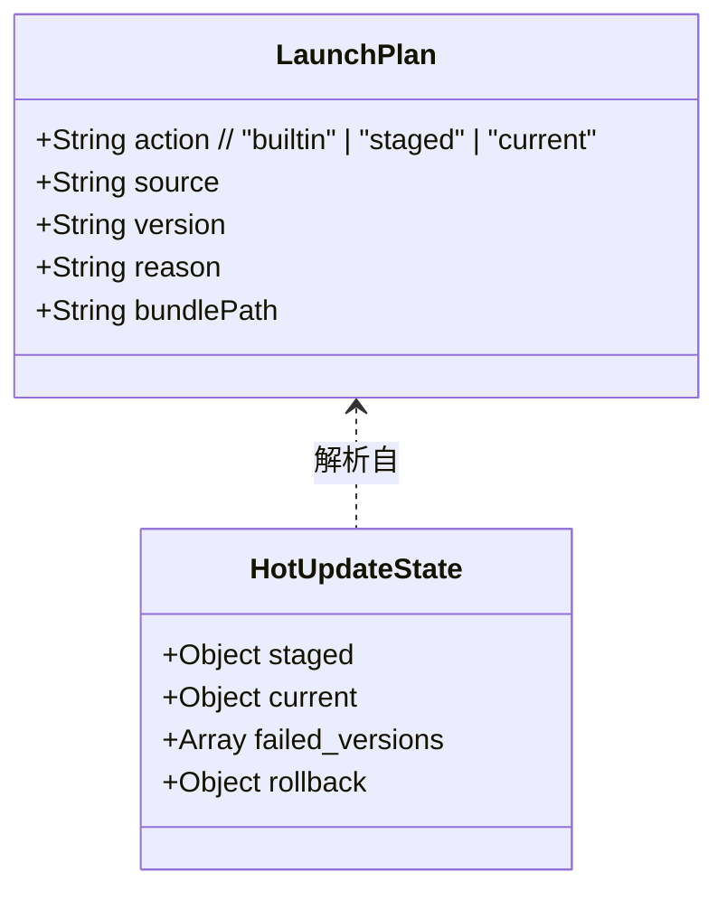

# 热更新引导调度器 (hot_update_bootstrap.js)

## 1. 模块定位与职责

在成绩查询 App 的 Tauri 架构中，OTA（Over-The-Air）热更新并非直接覆盖老文件，而是采用“沙箱替换”策略：下载补丁、解压至隔离目录，在下次启动时**重定向加载入口**。
`hot_update_bootstrap.js` 是启动环节的“总调度长”。在进入 Vue 核心代码前，它要读取并决断：当前到底该加载内置(builtin)版本，还是加载已解压妥当的 staging (staged) 版本，或是维持现有(current)的更新版本。

## 2. 状态推测与启动计划解析

核心方法：`resolveHotBundleLaunchPlan(state, stagedManifest, currentManifest, context)`。
它的输出是一个 JSON 指令，告诉启动器去读哪个路径下的 JS：



### 决断逻辑树（Launch Plan Resolution）

```mermaid
flowchart TD
    A[入口点] --> B{是否有 Staged 版本?}
    B -- Yes --> C{触发下次启动?}
    C -- Yes --> D{是否在 failed_versions 黑名单?}
    D -- Yes --> F[使用 builtin降级, 标为failed]
    D -- No --> E{Staged Manifest 兼容性检查}
    E -- Pass --> G[action: staged, 激活新包]
    E -- Fail --> F
    
    B -- No / C -- No --> H{是否有 Current 版本?}
    H -- Yes --> I{Current 兼容性检查}
    I -- Pass --> J[action: current, 保持更新版本]
    I -- Fail --> K
    H -- No --> K[action: builtin, 回退底包]
```

## 3. 状态更替机制 (Success / Failure 判定)

### 3.1 激活成功 (`applyHotBundleLaunchSuccess`)
当成功加载了一个版本后，App如果平稳运行不崩溃，将会调用它：
- 如果运行的是刚刚 Staged 里提取的版本，它会将 `staged` 槽位的内容晋升（Promote）到 `current` 槽位，并清空 `staged` 与 `rollback`。
- 如果本身就是 current，仅更新时间戳 `activated_at`。

### 3.2 致命回滚 (`applyHotBundleLaunchFailure`)
如果在读取这个包（如 JS 报错、白屏、版本校验爆红）时出错：
1. 取出出错包的 version。
2. 将其列入大牢 `failed_versions` 数组中。
3. 腾空导致崩溃的 `staged` （避免无限死循环热启）。
4. 放入 `rollback` 记录尸检报错。

使得下次再计算 Plan 时，直接根据黑名单路由至 `builtin`。极致保障 App 的高可用不砖。