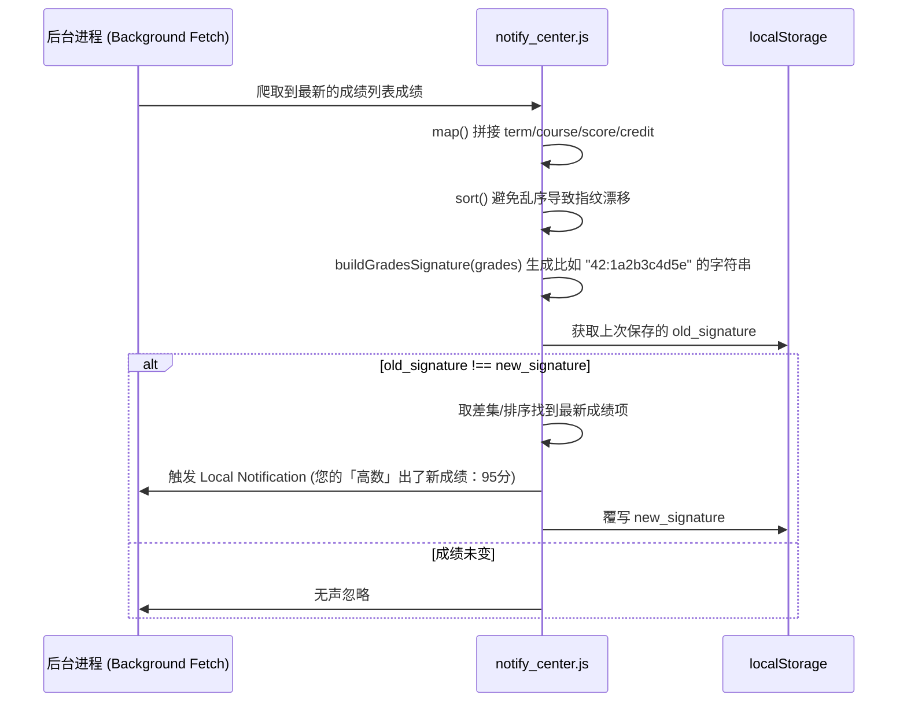

# 后台消息中心与全局通知调度管线 (notify_center.js)

## 1. 模块定位与职责

`notify_center.js` 是本地通知与推送业务的数据枢纽。
为了支持成绩查询、电费余额监控以及次日课表预告等强粘性功能，应用采用了前端计算而非服务器轮询（因为后端服务器无法储存所有学生的密码，所有爬虫均由本地触发）。本模块负责拉取并计算这些信息，进而下发唤醒系统通知（依赖 Capacitor API）。

## 2. 状态存储与常量注册
模块首部包含了大量与用户通知开关息息相关的常量，并依赖于 `LocalStorage` 进行无头 (Headless) 环境下的快速状态还原。

```javascript
const STORAGE_KEYS = {
  bg: 'hbu_notify_bg',                // 后台运行总开关
  exam: 'hbu_notify_exam',            // 考试前一天/当天预告开关
  grade: 'hbu_notify_grade',          // 成绩变动推送开关
  power: 'hbu_notify_power',          // 电费 < 10 度预警
  class: 'hbu_notify_class',          // 上课前 x 分钟播报开关
  classLeadMinutes: 'hbu_notify_class_lead_min', // x 分钟
  interval: 'hbu_notify_interval',    // 后台轮询间隔
  dormSelection: 'last_dorm_selection'// 用于查电费的宿舍四级联动地址
}
```

值得注意的是，代码还内置了完备的全局上下课时间表字典（`CLASS_PERIOD_TIME_MAP`），用于计算课程的具体上课时间（如第一节课 `08:20`），进而推算出 `classLeadMinutes` 发生的时间点。

## 3. 核心机制：全量指纹比对技术 (Signature Diff)
由于成绩系统并没有提供 Webhook 或是精确的 "Update Time" 字段。为了判断是否有新成绩出炉，系统采用了对成绩数组全家桶进行 MD5 特征哈希混淆的策略：



## 4. 边界处理与容错 (Robustness)

*   **API 故障隔离**：当网络在后台掉线（`isCapacitorRuntime()` = true），VITE 的 API Base 可能会处于 Localhost 或失效。这套组件硬编码了降级路由池（`FALLBACK_API_BASE`）。
*   **安全解析工具原语 (Safe Parsers)**：封装了极大量的对空指针、意外 `NaN` 防御的代码。如 `toSafeNumber` 剔除字符前缀，或者 `toPositiveInt` 将非法轮询间隔（例如 0 分钟）纠正为默认值。防线非常周密，避免底层死循环拉取，过度发热。