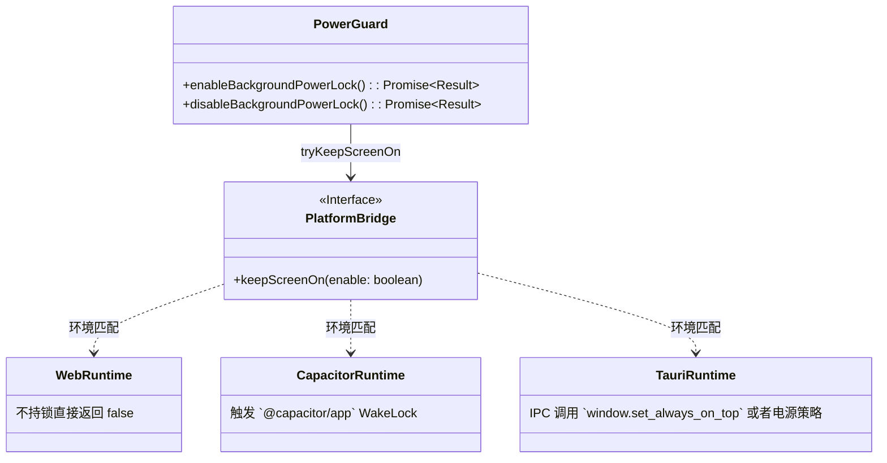

# 跨端电源管理与唤醒锁防护池器 (power_guard.js)

## 1. 模块定位与职责

`power_guard.js` 是用于解决深层操作 (如长时间教务处数据全量爬取、考研资料批量压缩下载等) 时，防止宿主操作系统黑屏休眠导致 JS 运行时被强制挂起而设计的高级管控接口。
通过封装 Tauri 端和 Capacitor 端的系统底层 WakeLock 调用，向前端的业务提供完全无感知的异步加锁/释放锁操作。

## 2. 设计与运行时分发

该模块完全依赖前面重构过得 `@/platform` 异构基建进行通信（其中注入了 `Native.ts` 中针对 Rust 的 `invoke("toggle_awake")` 或 Capacitor Plugins 的调用）：

## 3. 核心 API 解析

### 3.1 锁申请（`enableBackgroundPowerLock`）
返回值设计为包含日志追踪的元组信息 `{ enabled: boolean, source: string[] }`。
*   如果是纯 Web 环境下（开发模式或者 Safari 直接访问），因为缺乏 W3C Screen-Wake-Lock API 的通用支持或者存在强权限拦断，工具直截了当回退返回 `false`。
*   其他环境若获取锁成功，在日志组件可以通过 `source[0]` 定位是触发了 `tauri-keep-screen-on` 还是 `capacitor-wakelock`。

### 3.2 锁释放（`disableBackgroundPowerLock`）
与申请相对，必须严格成对出现（建议使用原生的 `finally` 块包扎，避免前端报错崩溃后永久亮屏进而耗干电量），撤销对设备的控制权。