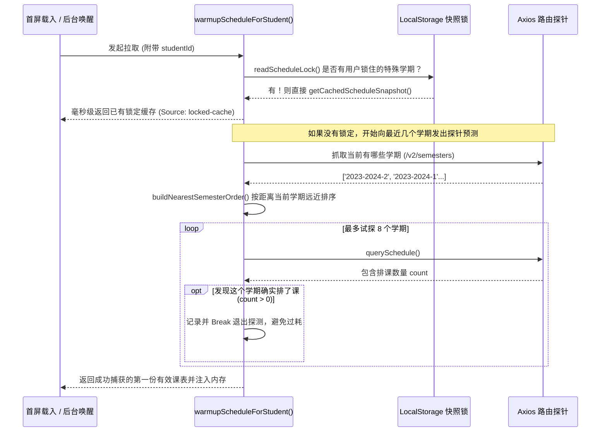

# 课表预加载预热器与学期快照锁 (schedule_prefetch.js)

## 1. 模块定位与职责

在用户打开 App 的第一时间，往往希望能做到零秒内展示首屏。对于“成绩查询”类 App 来说，最高频查看的就是当前学期的课表。
`schedule_prefetch.js` 就是为了解决**启动白屏**与**网络等待**而构建的高级数据仓库缓存与后台静默打工仔模块。它不仅调度了本地 `LocalStorage` 的取用，还包含一套启发式的“下一个学期或最近学期”全景探测器。

## 2. 核心状态键管理

预留了一组持久化的 Flag（标签），用来和 UI 视图（比如 Home.vue）以及 Background Fetch 进行多线程对话。
```javascript
const SCHEDULE_META_KEY = 'hbu_schedule_meta'               // 保存开学日期、总周数
const SCHEDULE_LOCK_KEY = 'hbu_schedule_lock'               // 当用户手动切换到旧学期查看时进行锁定防止预热器覆盖
export const SCHEDULE_POPUP_PENDING_KEY = 'hbu_schedule_popup_pending' // 通知 UI 有一个课表更新可以点出弹窗报告
export const SCHEDULE_SWITCH_PENDING_KEY = 'hbu_schedule_switch_pending' // 指示 Router 自动切换学期
```

## 3. 预热引擎分析 (`warmupScheduleForStudent`)

这是该模块中最具业务深度的逻辑之一。



## 4. 探针算法设计：钟摆式回环搜索 (`buildNearestSemesterOrder`)

如果在暑假，学校系统可能没上课，这时的探针如果是线性向前或向后找，很容易进入死胡同。
模块实现了一个围绕 `anchorSemester` 进行**左搜一下、右搜一下 (Offset 钟摆偏移)** 的算法，使得以目前时间推演出的基准学期为中心向两旁蔓延：
```javascript
  for (let offset = 0; order.length < list.length; offset += 1) {
    // 先找老一届 (olderIndex = anchorIndex + offset)
    // 加入到搜查队列
    ...
    // 再找新一届 (newerIndex = anchorIndex - offset)
    // 加入到搜查队列
  }
```
保证预热首屏出现的排课数据有极大的概率命中用户的直觉直觉需要。