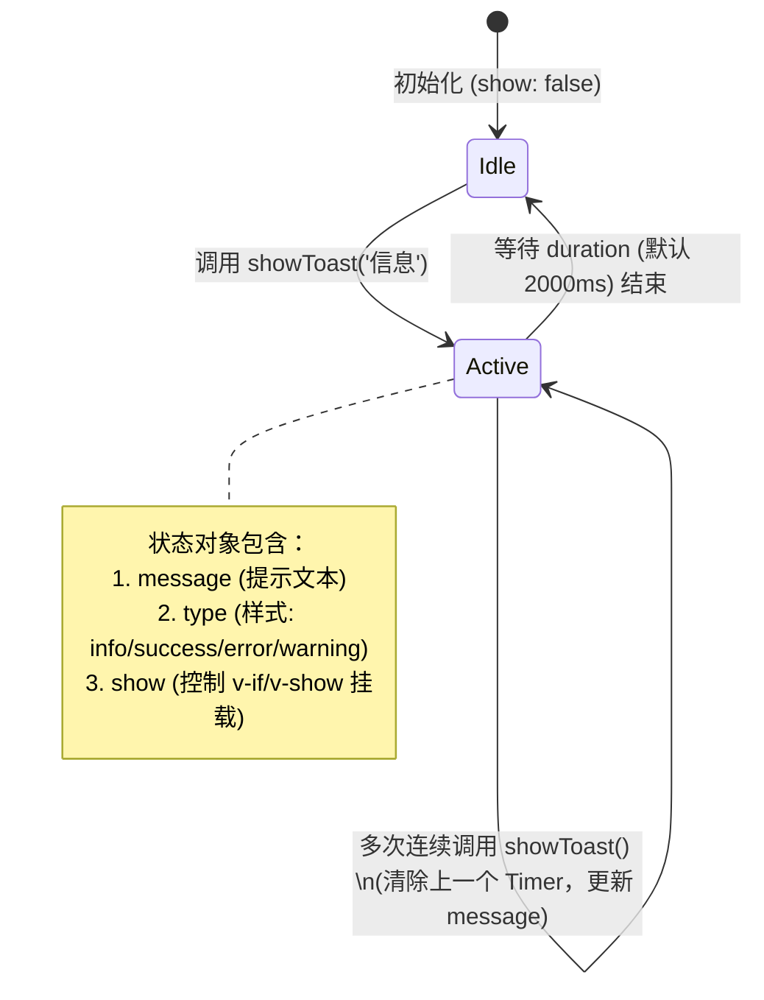

# 轻量级全局消息提示组件状态 (toast.js)

## 1. 模块定位与职责

`toast.js` 提供了一个基于 Vue 3 响应式 API (`reactive`) 的极简全局消息气泡 (Toast) 状态管理器。
它用于替代传统基于组件实例挂载或者第三方 UI 库（如 ElementPlus 的 ElMessage）的重型实现，确保在任何业务逻辑、Axios 拦截器甚至是原生事件回调中，都能轻松地触发页面顶部的临时消息通知。

## 2. 状态机与工作流

该模块没有引入 Pinia 或 Vuex，而是直接在模块作用域导出一个原生的 `reactive` 对象。依托 Vue 3 的 Composition API，任何引入此状态的 UI 组件（例如 App.vue 中的一个 `<Toast />` 组件）将自动追踪此状态变更并更新 DOM。



## 3. 核心代码解析

### 3.1 响应式存储 (`toastState`)
```javascript
export const toastState = reactive({
    show: false,
    message: '',
    type: 'info', // info, success, warning, error
    timer: null   // 保存当前的 setTimeout 句柄用于防抖刷新
})
```
这是一个单例状态。Vue 组件可以通过 `import { toastState } from '@/utils/toast'` 并在模板中直接使用 `toastState.message` 进行渲染绑定。

### 3.2 触发动作与防抖覆盖 (`showToast`)
```javascript
export const showToast = (message, type = 'info', duration = 2000) => {
    // 核心：若有旧的倒计时，立即销毁，防止旧倒计时将新消息提前关闭
    if (toastState.timer) {
        clearTimeout(toastState.timer)
    }

    toastState.message = message
    toastState.type = type
    toastState.show = true

    // 设置在 duration 毫秒后自动消失
    toastState.timer = setTimeout(() => {
        toastState.show = false
    }, duration)
}
```
**防御性设计**：如果用户疯狂点击某个报错按钮，触发了十次 `showToast`，该逻辑能够保证每次调用都**重置**停留计数器。也就是说，消息会保持显示，直到最后一次点击后等待 `duration` （默认两秒）才消失，避免了通知面板出现诡异的快速闪烁 (Flickering)。

## 4. 最佳实践建议

由于该模块完全与 UI 视图分离，这意味着：
1. **多层深级调用**：可以在 API 请求失败（如 `axios.interceptors.response`，即便未处在组件上下文中）时，直接调用 `showToast('网络超时', 'error')`。
2. **轻量加载**：避免了在纯函数脚本中初始化重量级的 UI DOM 树，非常适合目前 Tauri 混合桌面的高内聚无头 (Headless) 风格。