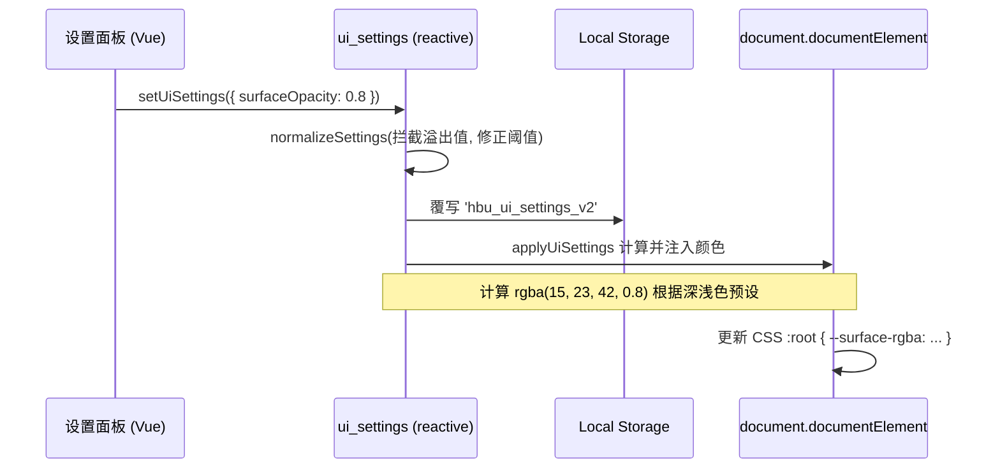

# 用户界面高级设置管理核心 (ui_settings.ts)

## 1. 模块定位与职责

随着 App 发展，不同用户对界面的偏好存在巨大差异（毛玻璃 vs 纯色、紧凑 vs 宽松）。
`ui_settings.ts` 结合了 `SYSTEM_UI_SETTINGS` 并封装了 Vue 的响应式 `reactive` 状态，对 UI 的各项细微因子（卡片透明度、字体圆角缩放、动画倍率占比）提供中心化的读取、覆盖以及本地存取支持。

## 2. 核心架构与 CSS 变量桥接

不仅是保存配置，当发生改变时，该模块会自动执行底层转化逻辑：
将用户的 UI 选择，转变为原生的 CSS Variables（如 `--surface-bg`, `--border-color`），从而直接驱动全身组件渲染（CSS 层级联）。



## 3. 面板配置项深度剖析 (`normalizeSettings`)

为防止 LocalStorage 中混入脏数据（如旧版残留），模块引入了极为庞大的洗数据兜底方案：
```javascript
const CARD_STYLES = ['glass', 'solid', 'outline']
const NAV_STYLES = ['floating', 'pill', 'compact']
```
所有的缩放比（Scale）都有了明确边界限制钳位 `clamp()`，保障 App 不会因为用户误调而崩溃，例如：
- `fontScale`: `[0.82, 1.2]` 即字体最大只能调到 120%，避免撑爆课表格子。
- `motionScale`: `[0.2, 1.3]` 允许动画加速或稍微减速，但绝不归零引起异步事件卡死。

## 4. 极客高阶定制支持 (`applyCustomCode`)

这是为高玩用户留的终极后门（The Geek Hatch）。允许在 App 内部存入并在启动时原样注入自定义的样板（Custom CSS）和执行短脚本（Custom JS）。

```javascript
  const scriptEl = document.createElement('script')
  scriptEl.id = 'custom-theme-js'
  scriptEl.type = 'text/javascript'
  scriptEl.textContent = settings.customJs
  document.body.appendChild(scriptEl)
```
能够被用作深度自定义课表背景逻辑，也是为了让民间社区开发 “皮肤补丁” 预留的最佳入口。