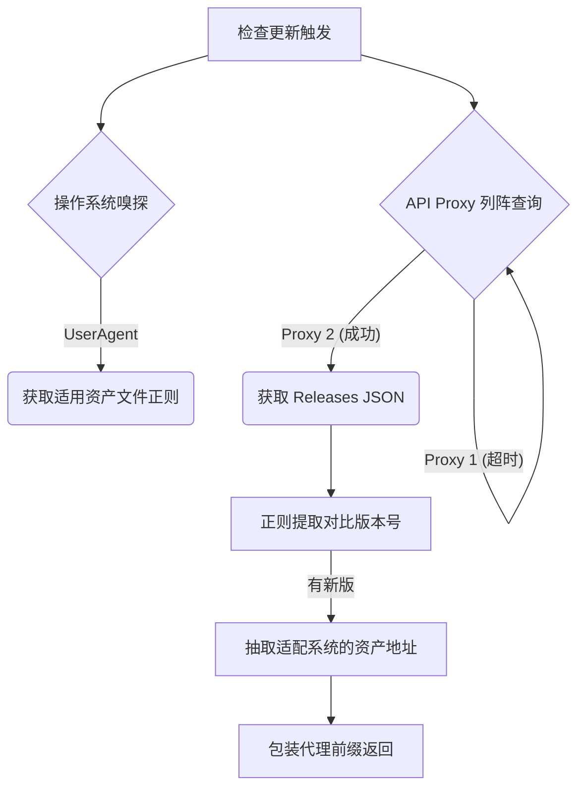

# 更新调度器与镜像源穿透网关 (updater.js)

## 1. 模块定位与职责

有别于依赖 Tauri Native Plugin 构建的底层沙箱拉包框架（`hot_update.js` 提供软更新），`updater.js` 是**全量包（APK / EXE / DMG）直接更新诊断器**。
面对国内复杂的网络环境与针对 GitHub 的多源头长城封锁，它实施了一套高可用性的 GitHub Releases 穿透抓取与版本决策流。

## 2. 动态镜像与代理探针阵列 (`API_PROXIES` & `DOWNLOAD_PROXIES`)

若用户无法直连 GitHub，这里准备了多维降级通道：

```javascript
const API_PROXIES = [
  `${GH_PROXY_PREFIX}https://api.github.com/repos/${GITHUB_REPO}/releases/latest`, // GH-Proxy中转
  `https://api.github.com/repos/${GITHUB_REPO}/releases/latest`,                     // 官方直连探针
  `https://cdn.jsdelivr.net/gh/${GITHUB_REPO}@latest/package.json`                   // jsDelivr 降级
]
```

### 多流轮询器设计

1. 模块依次向探针发包，附加强硬的 9000ms 超时限制 `withTimeout(fetch(...), 9000)`，防止出现黑洞效应。
2. 一旦任一探针成功解析出 JSON，立刻终止其他请求。
3. 如果连 Releases API 都跪了，则解析备用的 JsDelivr 里的 `package.json` 中的 `version` 字段，通过 `normalizePackageJsonAsRelease`，临时伪造一份 Release 数据对象给外壳。使得 App 永远“不会丢失视线”。

## 3. 操作系统探针与产物过滤 (`getAssetPatterns`)

Tauri 是一套跨平台包，而 GitHub 的 `assets` 里混合了五花八门的产率。怎么自动拿到正确的链接给用户点？
依靠 `navigator.userAgent` 嗅探所在的系统环境：
- Windows: 提取 `x64-setup.exe` 或 `.msi`
- Mac: 提取 `.dmg`
- Android (WebView包): 提取 `.apk`

找到适配系统文件后，再次套接上文的 `DOWNLOAD_PROXIES` 组装返回，如 `HK_DOWNLOAD_PROXY_PREFIX` 的香港高速代理点进行实际二进制下载跳板。

## 4. 架构图解

