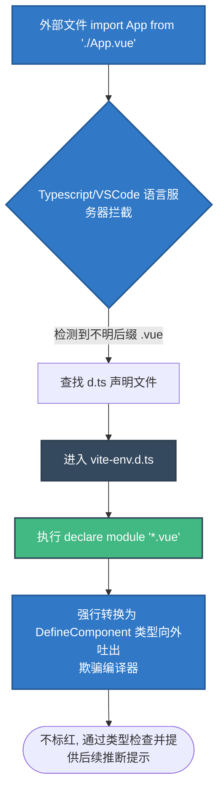

# `src/vite-env.d.ts` Vite 环境类型声明兵工厂解析

## 1. 文件概览

`src/vite-env.d.ts` 虽然常常被开发者忽视并且只有寥寥几行，但它是使 TypeScript 和 Vite （目前最流行的前端构建工具）在这套 Vue 高阶生态系统中能够“理解彼此黑话”的法定通牒契约。
它属于所谓的 “环境描述文件（Environment Declarations）”，没有它，TypeScript 在检查项目中导入 `.vue` 结尾这类非 JS/TS 文件时将会全面崩溃标红。

### 1.1 核心职责与功能
1. **唤醒 Vite 专属管线类型**: 导入并使项目挂载 Vite 的内建预设（如对 `import.meta.env` 各种环境变量的识别）。
2. **垫片修补 (Shim/Stub)**: 为整个编译器强制规定了 `*.vue` 文件的解析逃生舱，让外部感知其为一个合法的 `DefineComponent`。

---

## 2. 编译拦截解析流向图



### 2.1 架构深度解读

#### a. 客户端预设挂载 (`<reference types="vite/client" />`)
```typescript
/// <reference types="vite/client" />
```
这看似是一个被注释掉的斜杠，实则是高能的 "三斜线导言指令"。依靠它，工程中的所有 TS 文件突然“开天眼”，能识别诸如 `import.meta.env.VITE_SOME_KEY` 这种 Webpack 时代没有的高级货。它替开发者补全了导入诸如 `*.css`, `*.png?url`, `*.raw` 等 Vite 特有的模块魔法路径声明。

#### b. Vue 单文件组件的魔法障眼法 (`declare module '*.vue'`)
```typescript
declare module '*.vue' {
  import type { DefineComponent } from 'vue'
  const component: DefineComponent<{}, {}, any>
  export default component
}
```
原本的 TypeScript 本质上**是个傻子**，它只认识自己 `.ts` 或者 `.js` 扩展名的兄弟。当他在 `main.ts` 里看到 `import App from './App.vue'` 时就会因为找不着模块而红光大作。

这段类型劫持相当于：告诉 TS 编译器：“如果以后你看到任何以 `.vue` 结尾的东西，不要抛砖，你只要把它们统统当作由 `vue` 包里引出的泛型构件 `DefineComponent` 就好了，剩下的渲染让另外的插件去做。” 借此不仅摆脱了错误地红线警告，也为主流 IDE（如 VSCode 或 WebStorm）跨文件推断 Vue 内部导出的 Props 和 Emits 埋好了钩子。

---

## 3. 在工程中的地位

在这个跨足桌面端与移动端的高负载项目中，会有成百上千个 Vue 模块飞来飞去。这几个字虽少但是重于泰盘的环境声明（Typing Definition），彻底打通了纯静态检查的 TypeScript 世界与 Vue 运行时（Runtime Template）之间的柏林墙。属于典型的“平时看不见，但如果删除了应用立马大崩盘”的底层神经系统设施。