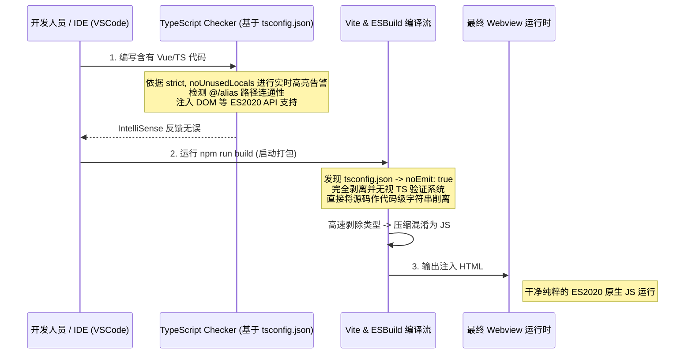

# `tsconfig.json` 深度解析文档

## 1. 定位与核心功能

本文件是全域 TypeScript 生态的语法和编译指南针。无论代码将被发送到 `vite` 进行前端构建（Tauri/Capacitor 两头通吃），还是利用 `tsc` 探针检查语法，所有的检查门槛均由此文件统领。

它是标准的前端工程 `tsconfig` 衍生结构，但它的每一个设定都直接适配 Vue 3 Setup Script 和 Vite 高速构建管线。
它的核心功能包括：
1. **统一 ECMAScript 目标基准线**（限制最古老兼容到 `ES2020`）。
2. **重度代码静默化（类型安全）**：它规定了严苛的变量检查规则，遏制由于弱类型导致的用户信息爬取解析出错。
3. **别名网络桥接**：控制 Vue/React 路径中 `@/` 导入语法的编译指引。
4. **编译剥离**：通过 `noEmit` 截断 TypeScript 自身的转译功能，正式确立 “TypeScript 仅做类型推导，真正的输出由 ESBuild / Vite 全权掌控” 的职责边界。

## 2. 逻辑原理与架构关联

### 2.1 高度分离的编译职责（`noEmit: true` & `moduleResolution: "bundler"`）
传统的 `tsc` 工作流是读取 `.ts` 文件然后输出 `.js` 文件。然而在此工程中，配置了 `"noEmit": true`。
这一举动在工程逻辑上的意义是：TypeScript 编译器退化并升华为**纯逻辑检查器（Linter/Type Checker）**。由于 Vite 使用 Go 语言编写的 esbuild 进行极速转码（不含类型校验），这形成了双规机制方案：Vite 只管闪电打包运行，而在提交前，通过 `vue-tsc --noEmit` 来兜底拦截类型崩溃等安全类问题。

`"moduleResolution": "bundler"` 这一非常现代的配置进一步匹配了这一策略：它允许导入没有 `.ts` 后缀，同时也支持类似 `package.json` 中的 `exports` 表。这对于加载 `@tauri-apps/api` 与 `@capacitor/core` 这种大型组合体（其底层使用了现代 module fields）是不可或缺的配置点。

### 2.2 D.TS 与 Vue 指令环境 (`useDefineForClassFields`, `jsx`)
- `"useDefineForClassFields": true` 契合了 ECMAScript 标准对类字段的定义要求。如果在后续涉及到面向对象的数据解析（如：在获取教务请求时的复杂对象序列化），它的行为将严格遵循标准而不是 TS 的早期变体遗留行为。
- `"jsx": "preserve"` 虽然项目主题可能是 Vue ，但设置 preserve 指示编译器不对 `.tsx` / JSX 结构作 `React.createElement` 等转化，原封不动地保留并递交给下一棒（如 `@vitejs/plugin-vue-jsx`）处理。

## 3. 代码级深度拆解

### 3.1 苛刻的编码纪律约束 (Strict Mode System)
```json
"strict": true,
"noUnusedLocals": true,
"noUnusedParameters": true,
"noFallthroughCasesInSwitch": true
```
此四剑客直接将本组代码安全性拉满：
1. `strict`: 连坐包含严防空指针异常（`strictNullChecks`）和隐式 Any 推断。在处理不确定的教务爬虫解析包时（因为官方极易更改字段，时常抛出 undefined），必须显式处理判空分支。
2. `noUnusedLocals` & `noUnusedParameters`: 代码洁癖保证，凡是声明的变量必须被消耗；这不仅使生成的客户端包体积无赘余物，更能在庞大的重构过程中识别出僵尸函数。
3. `noFallthroughCasesInSwitch`: 防止 Switch 机制下意外因为遗漏 `break;` 导致落空穿透执行灾难，强制每个 case 都拥有终止态。

### 3.2 模块环境穿透指引
```json
"allowImportingTsExtensions": true,
"resolveJsonModule": true,
"isolatedModules": true
```
- `allowImportingTsExtensions`: 针对某些基于原生的文件要求连带后缀引入。
- `resolveJsonModule`: 本框架频繁用到读取 `remote_config.json` 或 `package.json` 中的包元数据做版本同步；此指令提供静态推断，使 `import config from './data.json'` 不仅不报错，还能享受完美的成员点访问提示（IntelliSense）。
- `isolatedModules`: 在 ESBuild 或者 Babel 单文件编译器环境下是必须的，禁止跨文件类型推断引起的命名空间宏等操作，因为极速打包器只能看到当前单个文件的 AST （抽象语法树）。

### 3.3 目录路由基站
```json
"paths": { "@/": ["./src/"] }
```
这是一个前端工程师无比熟悉的路径魔法，使得底层不论文件多深，都免于使用极其冗长且易错的 `../../../src/components` 的地狱式相对定界，这在庞大工程中极大维持了依赖树的整洁心智。

## 4. 架构中的工程化挑战与总结

在涉及 `tauri-app` 的混合构建时，还会联动 `tsconfig.node.json` (被 `references` 囊括)。主配置不包含 Vite 控制的 NodeJS 环境，这确保了 DOM/BOM 等浏览器接口不会越界污染到构建脚本或者后端指令代码。此边界在大型前端项目里，经常能阻断服务端代码调用到 `window` 造成的离轨。

## 5. TypeScript 编译职责转交时序图

下面这份 Mermaid 从工程层面表达了 `tsconfig.json` 是如何在开发时态与编译态分离工作的：



*(End of document. 此文档系统性地解释了高水平 TS 基建底座该有的全栈防护与解耦风范。)*