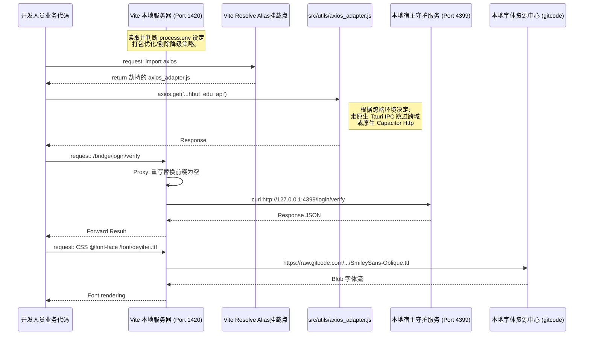

# `vite.config.ts` 深度解析文档

## 1. 定位与核心功能

如果说 `package.json` 挂载了兵力与宏观指令，那么 `vite.config.ts` 就是 `mini-hbut` 项目内部编译执行时的大脑与前线指挥所。它是基于 Vite 的核心配置文件，它负责接管项目的所有前端源码文件处理、打包压缩策略、环境变量注入以及开发阶段极其关键的本地代理（Proxy）转接服务。

从这段工程的特殊代码来看，它在配置上突破了标准 Vite 模板的基础维度，包含了极其具备业务色彩的硬核定制：
1. **环境变量精细注入**：直接利用 Node `fs` 提取 `package.json` 强绑定版本号，并通过注入构建配置文件确定应用处于 `standard` 还是极速开发档 `dev-fast`。
2. **底层底层请求劫持机制**：引人注目的是 `resolve.alias` 中的 `axios` 劫持绑定逻辑。
3. **开发环境网络分发图谱**：开发环境 `server` 配置跨域 `proxy`，将特定请求拦截后重定向到系统后端层以及外部的字体仓库。

## 2. 逻辑原理与架构关联

### 2.1 基于配置预设的环境分轨（Profile）
文件在顶部解析出了 `buildProfile`：
```typescript
const buildProfile = process.env.MINI_HBUT_BUILD_PROFILE || 'standard'
const isReleaseProfile = buildProfile === 'release'
const isDevFastProfile = buildProfile === 'dev-fast'
```
这种设计允许 CI/CD 管道流动态注入构建预期。
- 当处于 `release` 时，构建系统不仅执行源码转换，还会触发 `drop: ['console', 'debugger']` 以移除代码中的高危调试残留，并且开启 `reportCompressedSize` 输出最终 gzip 大小报告。
- 当处于 `dev-fast` 模式时，关闭所有代码压缩（`minify: false`，`cssMinify: false`）并放宽 Chunk 包警告阈值上限，牺牲文件体积以求换取极其恐怖的热更及重载速度。

### 2.2 跨底层机制的 Axios Adapter 覆写
```typescript
resolve: {
    alias: {
        'axios': path.resolve(__dirname, 'src/utils/axios_adapter.js')
    }
}
```
结合本项目作为 Tauri / Capacitor 多端的应用底色，这一行配置**异常关键**。原生的 `axios` 如果在浏览器内核中运行必然遇到教务系统严格的 CORS（跨域）限制。这里的 alias 指令在编译图谱层将所有工程内执行 `import axios from 'axios'` 的语句，偷梁换柱般地重定向给了定制的适配器 `src/utils/axios_adapter.js`。这表明该底层极可能利用了 Tauri 原生的 IPC OS 网络请求插件来跳过 Web View 的跨域沙盒执行发包。

## 3. 代码级深度拆解

### 3.1 构建目标与依赖配置
```typescript
target: 'es2020',
chunkSizeWarningLimit: isDevFastProfile ? 1600 : 900
```
指定 `es2020` 的 target 意图保证相对较新的 JavaScript 解析引擎。对于 Tauri (使用较新的 Webview2 / Safari 14+) 或高版本 Capacitor 应用而言是完全兼容的，能够享受 BigInt, Optional Chaining 等更扁平高性能的操作库编译结构。避免其过度 pollyfill 导致包体积臃肿。

### 3.2 Dev Server 代理矩阵（Proxy Logic）
```typescript
server: {
    port: 1420,
    strictPort: true,
    watch: { ignored: ["**/src-tauri/**"] },
    proxy: { ... }
}
```
这里严格锁定端口为 `1420`，因为 Tauri 与 Vite 联调时，由于 Rust CLI 会启动一个监听前端资源的空挂载壳，若前端端口位移跳变将导致 Tauri 窗口白屏。`strictPort: true` 保证若端口被占用直接抛错而不是自增。它还忽略了监控 `src-tauri` 防止前端服务死循环重启（Rust 后端有专用的 `cargo watch` 控制机制）。

**特殊反代一：`/bridge`**
```typescript
'/bridge': {
    target: 'http://127.0.0.1:4399',
    changeOrigin: true,
    rewrite: (path) => path.replace(/^\/bridge/, '')
}
```
把所有的 `/bridge` 下的 XHR 前端请求，直接引流到主机的 `4399` 本地端口。这意味着除了 Tauri 提供的 Rust 后端通讯外，甚至还有一个独立的本地代理服务（基于之前信息我们猜测是基于 Python 驱动或特定 Daemon 驱动的安全代理或打码服务端）。

**特殊反代二：得意黑字体 `/font/deyihei.ttf`**
巧妙地将字体资源反代至第三方仓库原生 gitcode raw 流，防止在本地打包超大中文字体导致安装包变大，或是提升开发期内首次渲染网页不必要的本地传输损耗。

## 4. 衍生思考

从该配置文件能明显感知开发者对“速度优化”（构建极速配置通道）与“安全稳定”（屏蔽生产环境 debugger）有着近乎偏执的强力把控。而 Axios alias 是跨网沙箱突围技术的最好体现——将业务代码与底层网络发包引擎实现完全透明降级的隔离。

## 5. 架构逻辑时序图

以下 Mermaid 图表说明在 `vite dev` 启动并接受请求时，`vite.config.ts` 所主导的前端工作树流转与网络重定向原理：



*(End of document)*